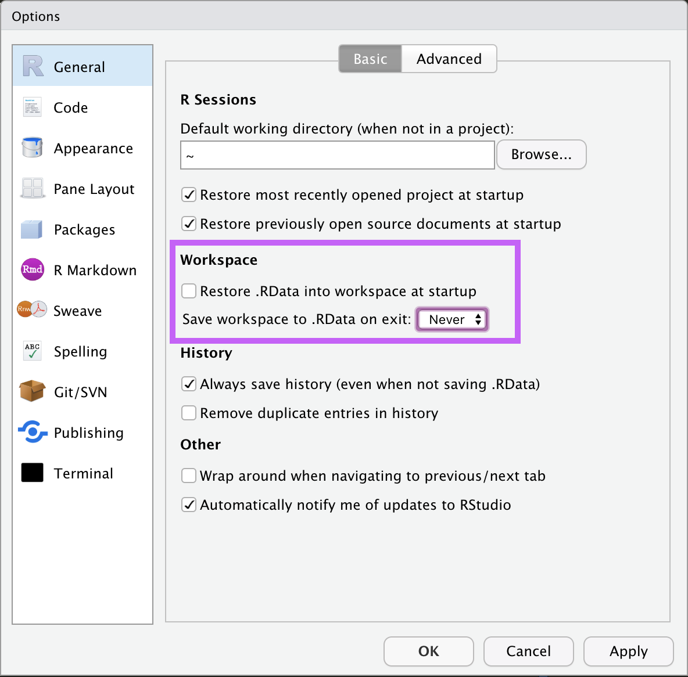

# Getting Started {-}

<span class="badge badge-bt"> BT1101 </span>

This course will be taught in `R`, which is a free statistical software environment (/ programming language) that makes it very handy to run data analysis. It is a fully *functional* programming language, and by that I mean two things:

- 1) In my experience, any operation that you want to do to data, you can do it in `R`. There are also many user-contributed libraries (called "packages"), which continually expand the capabilities that you can achieve with `R`.
In particular, I would like to highlight innovative tools like Jupyter notebooks and `R Markdown` documents which allow incredible flexibility in setting up a data analysis pipeline.
- 2) For programming language enthusiasts, R is also a [functional programming language](http://adv-r.had.co.nz/Functional-programming.html). There are some neat tricks that you can do by exploiting R's more advanced functional capabilites.


In particular, the R community is very active, which is another plus as it allows users to easily find answers online (e.g., by searching and asking on Stack Overflow).


#### How to download R and RStudio {-}

`R` is free, and can be downloaded from [the R Project website](https://www.r-project.org/). We will be using `RStudio`, which is an excellent development environment that makes it much friendlier to use `R`. You can download the free Desktop version at [the RStudio website](https://rstudio.com/products/rstudio/download/).


There are many online resources for learning both R and RStudio. For example, the RStudio website has several [Primers](https://rstudio.cloud/learn/primers) covering many relevant basic data science topics. There are also freely available books on how to use R, like [R for Data Science](https://r4ds.had.co.nz/).


### How to use R Markdown {-}

R Markdown documents are an extremely useful tool that professional data scientists and business analysts use in their day-to-day work. They allow for R code (and the output of R code) to be neatly formatted (using Markdown) into various output types, such as PDFs, HTML, or Microsoft Word Documents (note, for MS Word, you'll need MS Word installed on your system).

This process is called ``Knitting``. If you open a R Markdown document (`.rmd`) in RStudio, RStudio should automatically detect it and you should see a little command called `Knit` at the top of your source window. (If this is your first time, you may have to install a few packages like `knitr`; RStudio will helpfully suggest to install them.)

R Markdown is nice because it allows you to embed code and writeup into the same document, and it produces presentable output, so you can use it to generate reports from your homework, and, when you eventually go out to work in a company, for your projects.

Here's how you embed a "chunk" of R code. We use three apostrophes to denote the start and end of a code chunk 

````
```
{r, example-chunk-1, echo=TRUE, eval=FALSE} 
1+1
```

````

which (after removing the space between the apostrophes and the \{...\} on the following line) produces:

```{r example-chunk-2, echo=TRUE, eval=FALSE}
1+1
```

After the three apostrophes, you'll need `r`, then you can give the chunk a name. Please note that **NAMES HAVE TO BE A SINGLE-WORD, NO SPACES ALLOWED**. Also, names have to be unique, that is, every chunk needs a **different** name. You can give chunks names like:

- `chunk1`
- `read-in-data`
- `run-regression`

or, what will help you with homework:

- `q1a-read-in-data`
- `q1b-regression`

These names are for you to help organize your code. (In practice it will be very useful when you have files with thousands of lines of code...). Names are optional. If you do not give a name, it will default to `unnamed-chunk-1`, etc

After the name of the chunk, you can give it certain options, separated by commas. Here are some important options:

  - `echo=T` / `echo=TRUE` or `echo=F` / `echo=FALSE`: whether or not the code chunk will be copied into the output file.
  - `eval=T` / `eval=TRUE` or `eval=F` / `eval=FALSE`: whether or not the code chunk will be evaluated. If you set one chunk `eval=F`, it will be as if you commented all the code in that chunk; they just won't run. This can be super useful, if e.g. you have some analyses that take up more time, and you don't want to run them every single time you knit, so you can just comment them out using this one liner.


There is a lot to syntax to learn using the R Markdown. And lots of cool stuff too (e.g., interactive HTML documents).

In real work environments, one very applicable use-case for the R Markdown document is to generate regular reports using different data. For example, let's say every week you get some data (weekly sales) from another team. When you get a new data file, you could just edit one line of the R Markdown file (which data file it's reading in), and you can generate the exact same report that you did last week, just that now it's on this week's data. Exact same analysis, exact same graphs, just with new data. And it's professional enough to show your manager.


Note about *working directories* in R Markdown. If you do not specify your working directory via `setwd('...')`, and you hit `Knit`, the document will assume that the working directory is the directory that the `.rmd` file is in. Thus, if your rmd is in `XYZ/folder1/code.rmd` and your dataset is `XYZ/folder1/data.csv`, then you can simply read in a data file using the local path: `d0 <- read.csv('data.csv')` without running `setwd()`.


## Coding Best Practices {-}

### Ensuring a Reproducible workflow {-}


A very important concept in statistical data analysis (and in programming and science in general) is the concept of a reproducible workflow. What this means is that, given your code, anyone (including your future self) should be able to reproduce your results exactly.

To be more specific, imagine this scenario: 

- You are a data analyst at a company, and your manager tells you "hey, I really liked those graphs you made for your presentation last week, can you make these important changes and send it to me by lunchtime? I need to brief the C-Suite at 1pm".
- You get yourself a coffee, sit down at your machine, fire up your RStudio, and open up the file that you worked on last week late into the night. You try to run your script again, and to your horror, you find numerous errors. 
- You try to reconstruct your thought processes that night, as you click into this menu and that menu. "Did I click this checkbox or not when I imported the data?". "Did I import `data_version1` or `data_version2`?". "How come this function is giving me a different result now? Or is throwing an error now when it didn't last week?" 
- If you are lucky you are able to retrace every click you did. If not, you'll have to tell your boss that you can't reproduce that graph, let alone make the changes. Regardless, there will be a lot of mental and emotional cost that was unnecessary.


Now imagine this other scenario:

- You fire up your RStudio, hit a button, and your code automagically produces a nicely formatted report with the graph you made last week. You go into your code, modify a few lines to make the changes your manager wants. You run your code again, get the new graph out, send it to your manager, and happily move on to your next task.


Consider this last scenario:

- Your manager asks you for some additional analysis on James' project, but James had left the company last week. James had given you all his code, neatly organized.
- You plop James' code into your RStudio, and hit "run". It magically works!
    - Or, maybe it doesn't.
- Which world do you want to be in?
    - By the way, James doesn't even have to have left the company --- he could be a colleague in a remote team, or on leave that week, or otherwise indisposed to do that analysis, and you have to pick up where he left off. These types of situations happen all the time.
    - Isn't it much better for everyone to have a workflow that works again and again?


#### What is a reproducible workflow {-}


What a reproducible workflow means is:

- You should write every part of your data analysis pipeline into code.
    - This includes setting your working directory.
        - It is very handy to go to the point-and-click interface to set your working directory, since your file may reside deep in many other folders. For example, on Mac, I can click `Session` -> `Set Working Directory` -> `To Source File Location`. 
        - After you click this, RStudio will output a `setwd(...)` command in the console. For example: `setwd("~/stats-notes")`. **Take this line, and copy it into the preamble of your R script**, so that when you next open the file, you know which is your working directory and you can just set it by running that line.
            - Note: R Markdown has a different way of handling working directories. When you knit a Rmd file, it automatically assumes the working directory of the source file.
    - This also includes reading in your data.
        - Do **NOT** use the Import Dataset from the dropdown menu.
        - **DO** Use `read.csv(...)` or `read.xlsx(...)` or equivalent commands to read in your datasets.
    - This also includes loading libraries and packages.
        - Do **NOT** use the `Packages` pane of RStudio to click and load the packages you require for your analysis.
        - **DO** use `library(...)` to load in packages.


For more advanced analysts (including graduate-level researchers preparing publication-quality analyses), you may also want to consider:

- Putting all your data processing / data cleaning steps into code. So your code should take in the raw datafile (as raw as possible) and manipulating it only in R. (**NEVER EXCEL**).
    - If data processing takes too long to run every time, you could output a "cleaned" datafile and just read that in everytime you do analysis. But you should still save the data processing code just in case you need to modify it or check what you did.
    - This can be saved either in another R script or in a chunk in an R Markdown file with `eval=F` so that it won't run every single time. 
- Putting any exclusion criteria into code. This also allows you to modify your exclusion criteria if you needed to.


#### DO NOT SAVE .RDATA! {-}

A pre-requisite for a `reproducible workflow` is that everytime you fire up RStudio, it should be a clean session, with no data loaded and no libraries loaded.

This means that you should NOT save or reload your session. If RStudio ever prompts you to save your session (to a .RData file) upon exit, do not accept. 

You can customize RStudio to never do this by going into Preferences (see screenshot below for Mac OSX) and making sure:

- the `Restore .RData into workspace at startup` is *unselected*.
- the `Save workspace to .RData on exit` dropdown menu is set to `Never`.




Building habits to ensure a reproducible workflow takes time, but you will thank yourself later for this. It's never too early to start, and in fact, the earlier the better, so you do not have to unlearn bad habits. It's just like, for programming, learning programming conventions: why do people name their variables like this or structure their code like that? After you become much more proficient in programming, you'll see why it helps to make your code so much more efficient. This is the same with reproducibility.


### Other Coding Best Practices {-}

(This will be a growing list that I will add to.)

- Try not to re-use variable names or data frame names.
    - I highly recommend NOT doing something like: `d1$score = d1$score * 100`.
      - Why? Well, if you accidentally run that line of code again, your `score` will be 100x higher than you wanted it to be.
- Try having longer and more informative names.
    - Do **NOT** write something like: `mean = mean(d1$score)`.
        - Why? Doing this will overwrite `mean()` (the function that calculates the average) in the namespace with `mean` (the variable that you just created). This means (haha) that you will not be able to calculate any more means because typing `mean` would then reference the newly-created variable, not the function you had in mind.
      - Instead, try to be more informative `meanScore = mean(d1$score)`. If ever in doubt, just type the variable name into the console to see if it's already used. If it is, it'll print out a function or some data. If not, it'll say `Error: object 'x' not found`.
- Do not use very common letters like x, y, i, j. Especially as counter variables.
    - For example, what's wrong with the following code?
        - ```x = mean(d1$score)```
        - ```...```
        - ```for(x in 1:10) {```
        - ```    print(d1$score[x])```
        - ```  }```
    - Then later when you want to print out the mean score, you'll find that `x` is 10. And not what you expected.
    - I personally recommend using longer variable names, even for counter variables, and again, never re-using them.
          


### Analysis Best Practices {-}

(This will be a growing list that I will add to.)


