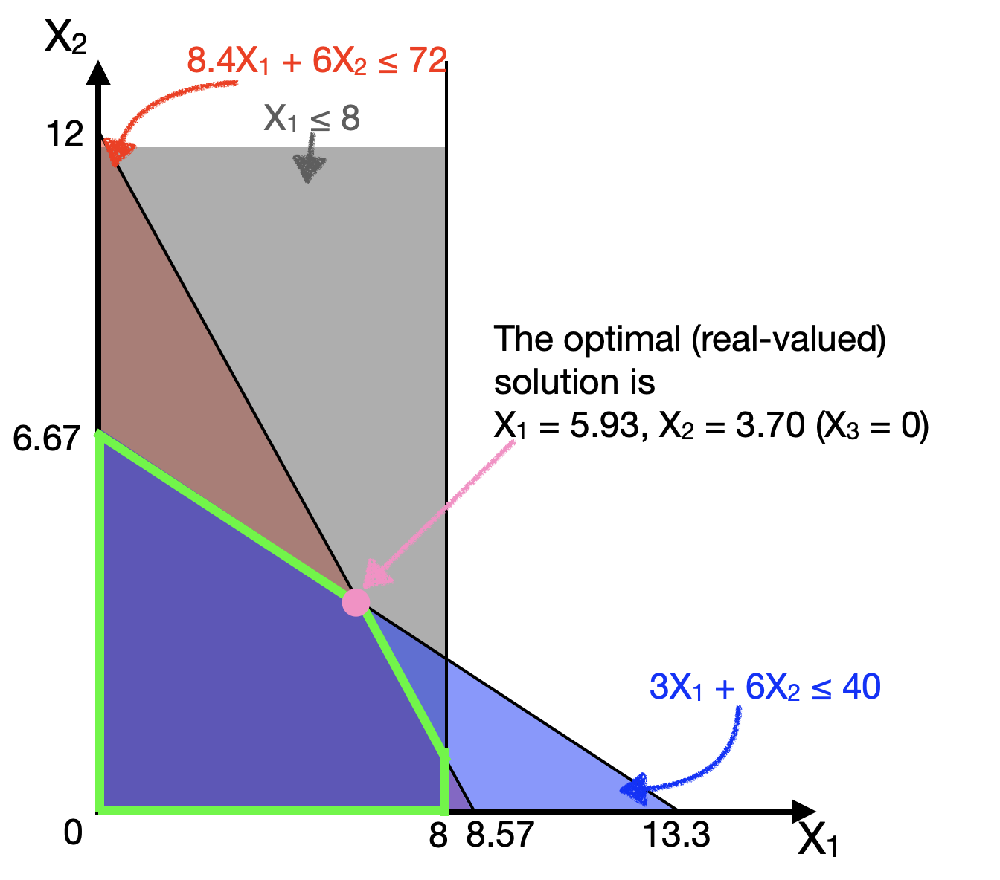
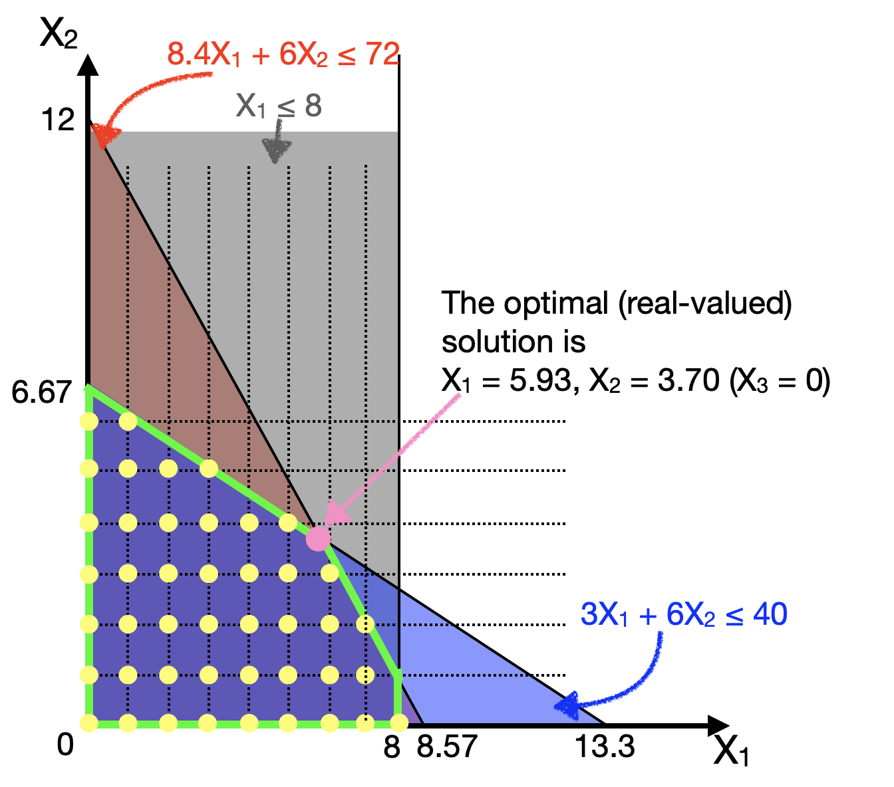
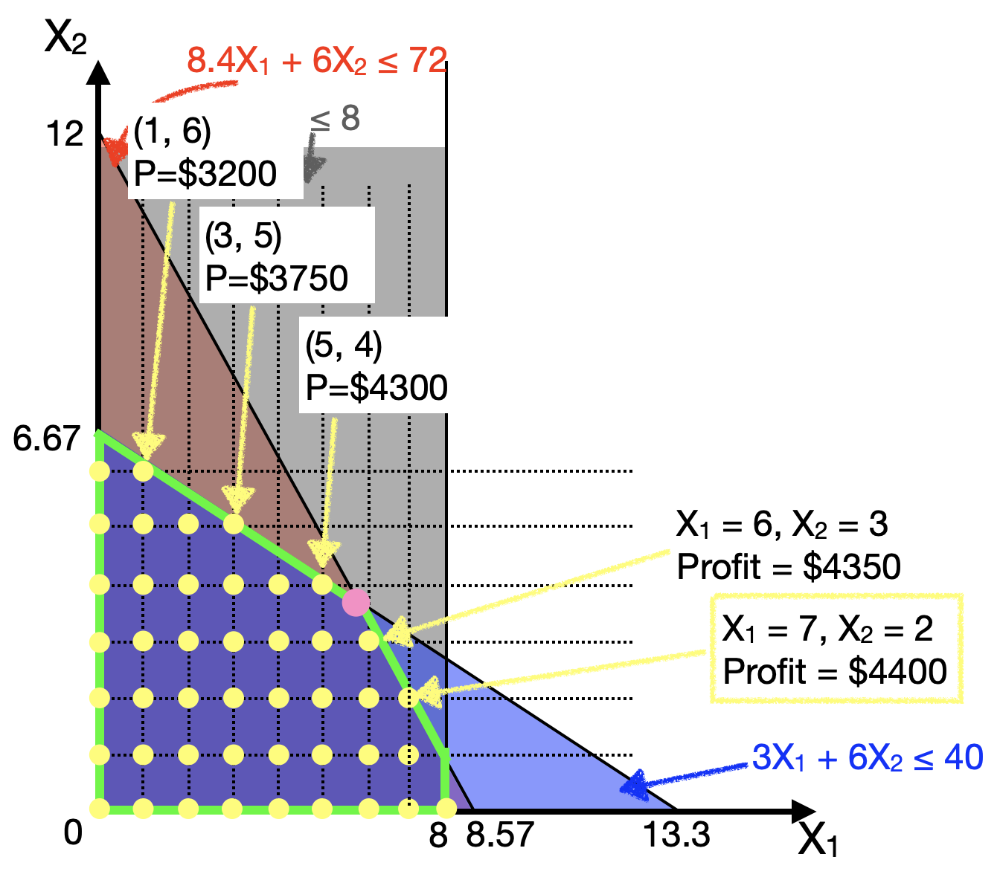

# Optimization II: Integer-valued Optimization

In this chapter we will continue our discussion of linear optimization, but now with the added complexity of considering problems with *integer*-valued decision variables.

The learning objectives for this chapter are:

- Readers should understand how and when integer constraints apply to optimisation problems.

- Readers should know how to use Linear-Program Relaxation (LP Relaxation) to gain insight into integer-constrained problems.

- Readers should understand how to solve integer-constrained optimisation problems.


```{r optimization-ii-setup, echo=T, warning=F}
# Load the libraries we'll use in this chapter
library(ggplot2) # for plotting
library(lpSolve) # for solving linear optimization problems ('linear programming')
```


## Integer-valued decision variables

In the previous chapter we learnt how to solve optimization problems by finding real-valued solutions to decision problems. Recall that in the Furniture Factory example, we discovered that the optimal solution was to produce 5.93 tables, 3.70 sofas, and 0 beds. But in real-life, we cannot produce fractional tables or sofas, so this becomes a problem, which we will learn to solve in this Chapter. 

In addition to decision variables like physical products (e.g., how many cars or tables to produce) that must be integer-valued, there are other examples of integer-valued optimization problems, such as:

- how many days to operate a factory; (perhaps operating costs are charged or rental contracts are executed for the whole day even if you only need some fraction of it)
- how many shifts to assign an employee; (another indivisible quantity)

Note that we can have some decision variables that are real-valued, and others that must be integer-valued. In such a case, we call this a **mixed-integer** optimisation problem.


We can also consider the special case of *binary-valued* decision variables (i.e., when your decision variable $X$ can only take values of 1 or 0). These can be used to model binary (Yes/No) decisions:

- Should I invest or not?    $X_i$ = 1 or 0
- Is worker Bob assigned to shift $j$?    $X_j$ = 1 or 0


And finally, we will also see how we can represent logical constraints using binary decision variables. This allows us to encode constraints like, "if A, then B". 


## From real-valued to integer solutions

Let's revisit the Furniture Factory example from the previous Chapter. Recall that the objective function, constraints, and solution are:


$$ X_1 = \text{number of tables made} \\
X_2 = \text{number of sofas made} \\
X_3 = \text{number of beds made} \\
\text{Maximize Profit} = 500 X_1 + 450 X_2 + 580 X_3 $$

Production Hour Budget Constraints:
$$  8.4X_1 +   6X_2 + 9.6X_3 \leq 72$$
Storage Space Constraints: 
$$      3X_1 +   6X_2 +    8X_3  \leq 40$$

Demand Constraints: 
$$    X_1 +    \qquad      +   \qquad       \leq 8$$

Non-negativity Constraints: 
$$ X_1 \geq 0; X_2 \geq 0; X_3 \geq 0 $$


And, the optimal solution is: 
$$X_1 = 5.93, X_2 = 3.70, X_3 = 0$$
Let us ignore the beds ($X_3$) for just a second, and plot the 3 constraints onto $X_1$ (tables) on the horizontal axis and $X_2$ (sofas) on the vertical axis (in the plane $X_3=0$).


```{r, echo=F, eval=T, out.width="500px", fig.align="center"}

```

The optimal solution ($X_1 = 5.93, X_2 = 3.70, X_3 = 0$) is given in pink. 

Now, if we want to impose an integer constraint, such that all our decision variables ($X_1$, $X_2$, $X_3$) must be integer valued, then our feasible solutions change. They cannot take on just any value, but only values indicated by the yellow dots below:


```{r, echo=F, eval=T, out.width="500px", fig.align="center"}

```

The first question that many people will ask is: 

> Well, can we just round off the real-valued answer to the nearest solution?

The answer is **No**, because in this case, the rounded off answer ($X_1=6, X_2=4$) is not a feasible solution (it lies outside the other constraints).

Then a natural response would be: 

> Can we then round down the answer, or round off the answer to the nearest feasible answer?

Maybe. But the nearest feasible answer is not guaranteed to be optimal! Have a look at the following plot, where the profit at several chosen yellow dots (near the constraint boundaries) are shown:


```{r, echo=F, eval=T, out.width="500px", fig.align="center"}

```

We can actually see that the nearest feasible answers (e.g., (5,4) and (6,3)) may not produce the optimal solution. In fact, the optimal solution in this plane (keeping $X_3 = 0$) is actually quite far away from ($X_1 = 5.93$, $X_2 = 3.70$). It is ($X_1 = 7$, $X_2 = 2$)! 


And actually if we *do* solve the integer-valued optimization problem (see below), we will eventually discover that the proper integer solution to this problem is 

$$ X_1 = 6, X_2 = 2, X_3 = 1 $$ 

which has a profit of \$4480. Recall that in the real-valued version of this problem, we concluded that beds were not profitable enough to make (optimal $X_3=0$). But adding the integer constraints may also change which constraints become binding, and which variables become relevant to the problem! Thus, suddenly the "not-so-profitable" Beds become profitable to make!


> In reality, solving integer-constrained optimization problems is a hard problem. In fact, in computer science jargon, this is one of a class of NP-Complete problems, which just means there exists no efficient (polynomial-time) method to find solutions to this problem. (Unlike in the simple linear optimization case where such methods do exist). This means that one approach to get the optimal solution is to brute-force search through every solution (the time-complexity of which grows very rapidly with the problem size); another popular approach to use heuristics or approximation algorithms to offer a best-guess at an answer.


### LP-Relaxation


We've seen that the optimal integer solution may not necessarily be near the optimal real-valued solution.

But that doesn't mean the real-valued solution is useless. In fact, the most common way to solve the integer optimisation problem is to FIRST solve the problem without the integer constraints.
Solving the optimisation without the integer constraints is called Linear Program [LP] Relaxation, because you "relax" the integer constraints.


Now, if you solve the LP relaxation, and the solution happens to be integer valued, then you can thank your lucky stars, because that solution is also the optimal solution to the integer problem.

- Think back to the example of Farmer Jean in the previous Chapter. In her case, the solution to her optimization problem was an integer number of plots of crops, (80, 120). Thus, even if we had to consider integer constraints, this solution is still valid. And in fact, it still remains optimal.
- Another collorary is that the objective of the optimal solution to the LP-relaxed problem (e.g., the maximum profit) is always better than or equal to the objective of the optimal integer-valued solution.


But this will not often be the case that the solution to the LP relaxation will be integer-valued. Then, programs use the real-valued solution as a starting point to systematically search for the optimal integer solution (such as the "branch and bound" algorithm used by `lpSolve`). 

### Specifying Integer Constraints

In order to tell `lpSolve` that we want to impose integer constraints, we simply add a new option `int.vec = c(...)`, where we give a `vec`tor of `int`egers. For example, if we want to specify in the furnitude example that $X_1, X_2, X_3$ are all integers, we specify `int.vec = c(1,2,3)`. (conversely, if only $X_2$ was an integer, we would write `int.vec=c(2)`.)

```{r optim-int-example-1a, echo=T, eval=FALSE}
lp.solution <- lp("max", objective.fn, const.mat, 
                  const.dir, const.rhs, int.vec = c(1,2,3),
                  compute.sens=FALSE)
# note: the sensitivity analysis calculated by lpSolve::lp()
# is inaccurate for integer-valued problems, so we won't use them.
```

And that's it. We can use the same functions `lp.solution` and `lp.solution$solution` to read out the optimal objective function value and the optimal values of the decision variables. Thus, for the furniture example above, we have:


```{r optim-int-example-1b, echo=T, eval=T}
objective.fn <- c(500, 450, 580)
const.mat <- matrix(c(8.4,  6, 9.6, 
                        3,  6,   8, 
                        1,  0,   0), 
                      ncol=3 , byrow=TRUE) 
const.dir <- c("<=", "<=", "<=")
const.rhs <- c(72, 40, 8)
# solving model
lp.solution <- lp("max", objective.fn, const.mat, 
                  const.dir, const.rhs, int.vec = c(1,2,3),
                  compute.sens=FALSE)

# to print out the optimal objective function value
lp.solution

# to print out the values of the decision variables (X1, X2, X3)
lp.solution$solution
```


Lastly, one final point to note is that the sensitivity analyses calculated by `lpSolve` may not be accurate for integer-valued problems (i.e., the effect of varying the objective function coefficients and shadow prices may not be accurate), so we choose not to have `complete.sens` in the function call. Of course, since we are already experts in this from last Chapter, we could always change the objective function coefficients or constraint values manually and try to solve it to estimate a sensitivity analysis, but the inbuilt convenience function doesn't do that for us. 


## Logical Constraints

Logical constraints can also be formalised as integer constraints. For example, let's say that $X_1$ is whether I decide to buy a new house, and $X_2$ is whether I decide to renovate the new house. We restrict both $X_1$, $X_2$ to be either $0$ or $1$. Obviously, I need to purchase the house before I can renovate it, so $X_1$ is a pre-requisite for $X_2$.

Using logic, I can write that: 

$$ \text{if I choose } X_2, \text{then I must choose } X_1  \text{ as well.} $$

This logical constraint can be formalised as the following integer-valued constraint:

$$X_1 - X_2 \geq 0$$
(In fact, this is not just an integer-valued constraint, but it is even stronger: the two variables are binary-valued).

The intuition is that if $X_2$ is 1, then this forces $X_1$ to be 1 too. Let us check:

- $X_1 = 0$, $X_2 = 0$: Constraint: $0 - 0 = 0 \geq 0$ is satisfied. This is fine since I don't purchase the house and I don't renovate the house.
- $X_1 = 1$, $X_2 = 0$: Constraint: $1 - 0 = 1 \geq 0$ is satisfied. This is fine since I can choose to purchase the house without renovating it. 
- $X_1 = 1$, $X_2 = 1$: Constraint: $1 - 1 = 0 \geq 0$ is satisfied. Again, this is fine since I can choose to both purchase and renovate the house. 
- Most importantly: $X_1 = 0$, $X_2 = 1$: Constraint: $0 - 1 = -1 \not \geq 0$. The constraint is *not* satisfied. This makes sense, because I cannot not purchase the house ($X_1=0$) but still choose to renovate it ($X_2=1$). 

Thus, we can check and see that this integer constraint correctly captures the intuition behind the logical constraint.


In general, the following table summaries how some logical constraints can be represented using binary decision variables:

Logical Condition | Linear Constraint
--- | ---
if $A$ then $B$ | $B - A \geq 0$
if not $A$ then $B$ | $B - (1 - A) \geq 0$, or $A + B \geq 1$
At most one of $A$, $B$ | $A + B \leq 1$
At least one of $A$, $B$ | $A + B \geq 1$
if ($A$ or $C$) then $B$ | $B - (A+C) \geq 0$
if ($A$ and $C$) then $B$ | $B - (A+C) \geq -1$, or $(A+C) - B \leq 1$
if $A$ then ($B$ or $C$) | $(B+C) - A \geq 0$
if $A$ then ($B$ and $C$) | $(B+C) - 2A \geq 0$


### How to specify logical constraints


Earlier we saw that to tell `lpSolve` that certain decision variables are integer-valued, we used an option `int.vec = c(...)`. If we want to tell `lpSolve` that instead some decision variables are binary-valued, then we use: `binary.vec = c(...)`. And that's it! `lpSolve` does everything else for us.

(In fact, it's harder to ensure that you have written down the constraints correctly!)


### Logical Constraints Example: Planning university courses

Let's see logical constraints in action in the following example.

Natalie has decided to switch her career to data science, as she feels it has more prospects than her previous industry. She is eyeing a "Pico-masters (TM)" program at her local university, where she has to complete 40 units of courses to satisfy the pico-degree. ("Pico-masters" and "nano-masters" are fictional---at least, for now---but some online education platforms and universities like edX are offering "MicroMasters<sup>&reg;</sup>" and other similar products.)

The program offers the following courses, in **ST**atistics, **P**ro**G**ramming, and **D**ata **M**anagement, along with their associated costs and pre-requisites. The pre-requisites for each course must be fulfilled before students are allowed to take that course. In order to finish the PicoMasters, she needs to finish a specialization in one of the three tracks, which is fulfilled by completing the "Level 3" version of that course. Natalie has also indicated her personal interest in each course, in the following table.


Course | Units | Pre-requisites | Interest
--- | --- | --- | --- 
ST1 | 10 | - | 8 
ST2 | 10 | ST1 | 4 
ST3 | 10 | ST2 | 6 
PG1 | 10 | - | 7 
PG2a | 10 | PG1 | 5 
PG2b | 10 | PG1 | 6
PG3 | 10 | PG2a *or* PG2b | 3 
DM1 | 10 | - | 4
DM2 | 10 | DM1 | 6
DM3 | 10 | DM2 | 7


Imagine that her goal is to maximize her interest and satisfy the requirements of the degree, while also taking exactly 40 units (in order to keep costs low). Which classes should she take?


First, let's define our decision variables, by just using $X_1$ to $X_{10}$ to correspond to taking each of the ten courses, in the order in the table above. That is,

$X_1$ = Take ST1, $X_2$ = Take ST2, $X_3$ = Take ST3, <br>
$X_4$ = Take PG1, $X_5$ = Take PG2a, $X_6$ = Take PG2b, $X_7$ = Take PG3, <br>
$X_8$ = Take DM1, $X_9$ = Take DM2, $X_{10}$ = Take DM3

Now let's tackle the constraints one-by-one.

Consider the following pre-requisite: 
```
Natalie needs to take ST1 before being allowed to take ST2. 
```

We can represent this using the following constraint:

$$ X_1 - X_2 \geq 0 $$

You can easily check if this is correct by 'testing' it by subtituting values. If Natalie takes ST2 (i.e., $X_2 = 1$), then we have the following inequality: $X_1 - 1 \geq 0$. In order for this also to be true, we need $X_1$ to also be 1. This means that Natalie taking ST2 ($X_2 = 1$) actually forces her to also have taken ST1 ($X_1 = 1$).

Similarly, we can write out the pre-requisite constraints for the rest. Now, let's consider one more case:

```
Natalie needs to take either PG2a OR PG2b before being allowed to take PG3. 
```

One easy thing to try is to replace ST2 ($X_2$) in the previous inequality with PG3 ($X_7$), and replace ST1 ($X_1$) with (PG2a or PG2b), or ($(X_5+X_6)$). So let's try:

$$ (X_5 + X_6) - X_7 \geq 0 $$

And actually this is the correct inequality! Let's test this out. If Natalie takes PG3, then $X_7=1$, and so we are left with:
$(X_5 + X_6) - 1 \geq 0$.
This inequality will be satisfied if $X_5$ is 1, or if $X_6$ is 1, that is, if she takes either PG2a or PG2b. (Note that this will also be satisifed if BOTH $X_5$ and $X_6$ is 1 -- there is nothing stopping her from taking both PG2a and PG2b!)


And finally let's consider the constraint that she needs to finish a specialization. That is, she needs to take either ST3 ($X_3$) or PG3 ($X_7$) or DM3 ($X_{10}$). This means that at least one of them needs to be 1. So we can just write:

$$ X_3 + X_7 + X_{10} \geq 0 $$

Please make sure you understand how we got (or how we tested/verified) the above inequalities!

Now, we can finally write out our optimization problem in a large table:


Decision variables <br> $X_1$ = Take ST1, $X_2$ = Take ST2, <br> $X_3$ = Take ST3, <br> $X_4$ = Take PG1, $X_5$ = Take PG2a, <br> $X_6$ = Take PG2b, $X_7$ = Take PG3, <br> $X_8$ = Take DM1, $X_9$ = Take DM2, <br> $X_{10}$ = Take DM3 | Maximize Interest = <br> 8$X_1$ + 4$X_2$ + 6$X_3$ + 7$X_4$ + 5$X_5$ + <br> 6$X_6$ + 3$X_7$ + 4$X_8$ + 6$X_9$ + 7$X_{10}$
--- | --- 
Subject to |  
Minimum Course Requirements (= for cost savings) | 10 $X_1$ + 10 $X_2$ + 10 $X_3$ + 10 $X_4$ + 10 $X_5$ + <br> 10 $X_6$ + 10 $X_7$ + 10 $X_8$ + 10 $X_9$ + 10 $X_{10}$ $=$ 40
Pre-Requisite for ST2 | $X_1 - X_2 \geq 0$ <br> or <br> 1 $X_1$ + (-1) $X_2$ + 0 $X_3$ + 0 $X_4$ + 0 $X_5$ + <br> 0 $X_6$ + 0 $X_7$ + 0 $X_8$ + 0 $X_9$ + 0 $X_{10}$ $\geq$ 0
Pre-Requisite for ST3 | $X_2 - X_3 \geq 0$ <br> or <br> 0 $X_1$ + 1 $X_2$ + -1 $X_3$ + 0 $X_4$ + 0 $X_5$ + <br> 0 $X_6$ + 0 $X_7$ + 0 $X_8$ + 0 $X_9$ + 0 $X_{10}$ $\geq$ 0
Pre-Requisite for PG2a | $X_4 - X_5 \geq 0$ <br> or <br> 0 $X_1$ + 0 $X_2$ + 0 $X_3$ + 1 $X_4$ + -1 $X_5$ + <br> 0 $X_6$ + 0 $X_7$ + 0 $X_8$ + 0 $X_9$ + 0 $X_{10}$ $\geq$ 0
Pre-Requisite for PG2b | $X_4 - X_6 \geq 0$ <br> or <br> 0 $X_1$ + 0 $X_2$ + 0 $X_3$ + 1 $X_4$ + 0 $X_5$ + <br> -1 $X_6$ + 0 $X_7$ + 0 $X_8$ + 0 $X_9$ + 0 $X_{10}$ $\geq$ 0
Pre-Requisite for PG3 <br> (PG2a OR PG2b) | $(X_5 + X_6) - X_7 \geq 0$ <br> or <br> 0 $X_1$ + 0 $X_2$ + 0 $X_3$ + 0 $X_4$ + 1 $X_5$ + <br> 1 $X_6$ + -1 $X_7$ + 0 $X_8$ + 0 $X_9$ + 0 $X_{10}$ $\geq$ 0
Pre-Requisite for DM2 | $X_8 - X_9 \geq 0$ <br> or <br> 0 $X_1$ + 0 $X_2$ + 0 $X_3$ + 0 $X_4$ + 0 $X_5$ + <br> 0 $X_6$ + 0 $X_7$ + 1 $X_8$ + -1 $X_9$ + 0 $X_{10}$ $\geq$ 0
Pre-Requisite for DM3 | $X_9 - X_{10} \geq 0$ <br> or <br> 0 $X_1$ + 0 $X_2$ + 0 $X_3$ + 0 $X_4$ + 0 $X_5$ + <br> 0 $X_6$ + 0 $X_7$ + 0 $X_8$ + 1 $X_9$ + -1 $X_{10}$ $\geq$ 0
Complete Specialization | $X_3 + X_7 + X_{10} \geq 1$ <br> or <br> 0 $X_1$ + 0 $X_2$ + 1 $X_3$ + 0 $X_4$ + 0 $X_5$ + <br> 0 $X_6$ + 1 $X_7$ + 0 $X_8$ + 0 $X_9$ + 1 $X_{10}$ $\geq$ 1
Binary, Integer, Non-Negativity Constraints | $X_1$, to $X_{10}$ all binary, integers and $\geq 0$.


Notice that I've written out the inequalities into longer forms with explicit "0"s, so

$$X_1 - X_2 \geq 0$$ becomes $$X_1 + (-1) X_2 + 0 X_3 + 0 X_4 + 0 X_5 + 0 X_6 + 0 X_7 + 0 X_8 + 0 X_9 + 0 X_{10} \geq 0$$

This makes it much easier to type this into code. This is the hardest part now, transfering this into code without making any mistakes!


```{r linear-constraints-example-courses, echo=TRUE}
#defining parameters
objective.fn <- c(8, 4, 6, 7, 5, 6, 3, 4, 6, 7)
const.mat <- matrix(c(rep(10,10),
                      rep(0,0), 1, -1, rep(0, 8), # ST2
                      rep(0,1), 1, -1, rep(0, 7), # ST3
                      
                      rep(0,3), 1, -1, rep(0, 5), # PG2a
                      rep(0,3), 1, 0, -1, rep(0, 4), # PG2b
                      rep(0,4), 1, 1, -1, rep(0, 3), # PG3
                      
                      rep(0,7), 1, -1, rep(0, 1), # DM2
                      rep(0,8), 1, -1, rep(0, 0), # DM3
                      
                      rep(0,2), 1, rep(0,3), 1, rep(0,2), 1 # complete specialization
                      ) , ncol=10 , byrow=TRUE) 
const.dir <- c("=", rep(">=", 8))
const.rhs <- c(40, rep(0,7), 1)

#solving model
lp.solution <- lp("max", objective.fn, const.mat, const.dir, const.rhs, 
                  binary.vec = c(1:10))
lp.solution$solution #decision variables values 
lp.solution
```


Thus, the final solution is $X_1$, $X_2$, $X_3$, $X_4$ = 1, with the rest = 0.

In order to maximize her interest while completing the degree, Natalie should choose to specialize in Statistics (taking ST1, ST2, ST3), and then also taking the first course in Programming (PG1).


## Integer Optimization Summary

In this lecture we've covered how to use linear optimisation to solved integer-valued optimisation problems, where some of the decision variables are constrained to be integers, or even constrained to be binary variables (which can be used to model yes/no decisions).

We've also seen how to transform logical constraints into linear constraints using binary variables. And we've also seen worked examples of problems with 10+ decision variables -- these problems scale up very fast!

The output of these problems can be very useful in helping managers make optimal decisions based on the data, and is the whole objective behind prescriptive analytics.


## Exercises: Integer Optimization


##### Q1 {-}

John is interested in buying ads to market his new startup. He sees the following options:

Ad | Cost per ad | Reach | Limits
--- | --- | --- | ---
Radio Ad | \$100 | 500 | 40 
Newspaper Ad | \$250 | 2000 | 10
Social Media Ad | \$50 | 300 | 80

The "limits" in the table above are imposed by each advertiser, so the Newspaper will only run a maximum of 10 Newspaper Ads. Reach is an estimated number of people that the ad will reach, per ad that John buys (e.g. if he buys 1 Radio ad, it will reach 500 people. If he buys 2, it will reach 1000 people.)


Q1a) Identify the decision variables, objective function and constraints. Write out the optimization problem in a table.

Q1b) Write R code to solve this problem. What is the optimal solution, and what is the value of the objective function that this optimal solution?


