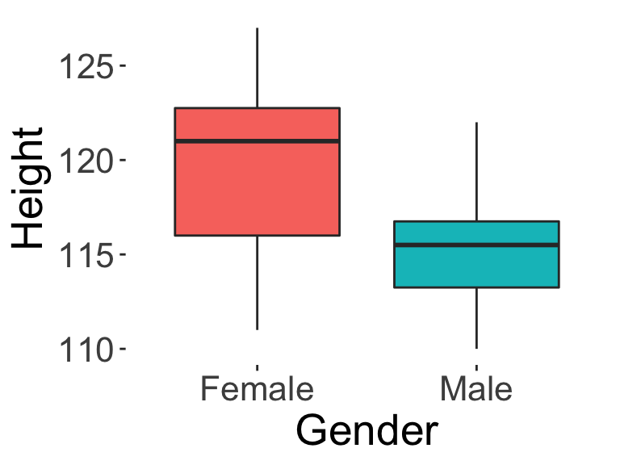
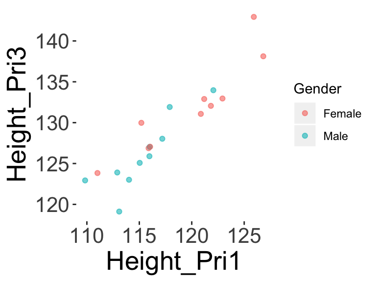
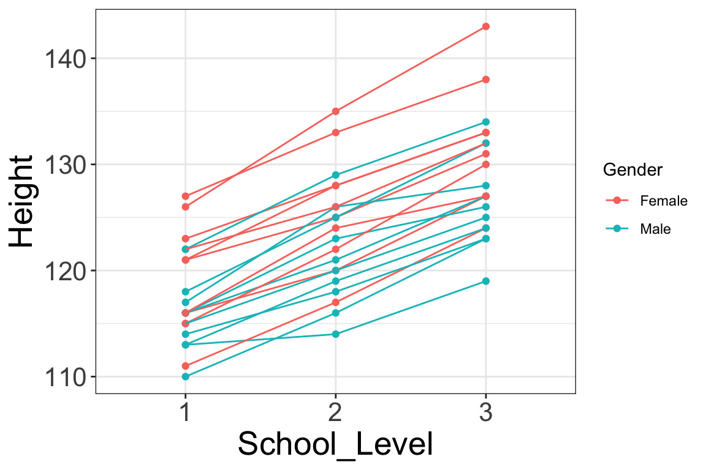

# Handling Data

This Chapter will discuss some basic details of handling data. We will go over different types of data representations, and how to go between them using `R` (especially using the `tidyverse` set of packages). 

The learning objectives for this chapter are:

- Readers should be able to distinguish what is `wide-form` data and what is `long-form` data.
- Readers should be able to convert `wide-form` data to `long-form`, and vice versa (e.g., using `tidyverse`).


```r
# Load the libraries we'll use in this chapter
library(ggplot2) # for plotting
library(pander) # for displaying tables

library(tidyverse) # for data munging
# tidyverse encompasses both tidyr and dplyr
#library(tidyr); library(dplyr)
```


## Basics of Data Wrangling

<span class="badge badge-bt"> BT1101 </span>

> Data wrangling, or data munging, is the process of "wrangling" data from one format to another.


Let us imagine that you are interested in the heights of every student when they enter school for the first time at Primary 1. You spend time recording the heights and gender of each student. One very obvious format to store the data is to record your results in a three-column table, with name, gender, and height (in centimeters) being the three columns.

<center>

--------------------------
  Name    Gender   Height 
-------- -------- --------
 Angela   Female    116   

 Brian     Male     110   

 Cathy    Female    121   
--------------------------


</center>

This is called `wide-form` data, where <b>each observation is a single row, and each variable is in one column</b>. This is a very common way of representing data, and is very useful for plotting variables. For example, when we have data in this format, we can easily call a function to represent the heights of Male vs. Female students using a boxplot, like below (see Data Visualization chapter for more on the boxplot and other visualizations).

<center>

</center>

Now, imagine that the following two years you get a chance to repeat the study with the same set of students. You collect their heights again at Primary 2, and at Primary 3. You decide to add two new columns, as follows:

<center>

-----------------------------------------------------------
  Name    Gender   Height_Pri1   Height_Pri2   Height_Pri3 
-------- -------- ------------- ------------- -------------
 Angela   Female       116           120           127     

 Brian     Male        110           116           123     

 Cathy    Female       121           125           131     
-----------------------------------------------------------


</center>

This is still `wide-form` data, as each student's data is still only in one row, and you have merely added two new variables as new columns. 

With this wide-form data, you could still do things like calculate the correlation between `Height_Pri1` and `Height_Pri2` using `cor(df_wide$Height_Pri1, df_wide$Height_Pri2)`, or plot a scatterplot between their heights in Primary 1 and Primary 3, like so:

<center>

</center>


But now if you wanted to do something like look at the change of height over time, this representation may not be the easiest to do that type of analysis. Ideally we would want a case where each row had `Primary School Level` and `Height`, perhaps like:


<center>

-----------------------------------------
  Name    Gender   School_Level   Height 
-------- -------- -------------- --------
 Angela   Female        1          116   

 Angela   Female        2          120   

 Angela   Female        3          127   

 Brian     Male         1          110   

 Brian     Male         2          116   

 Brian     Male         3          123   
-----------------------------------------


</center>

This is called `long-form` data, where each response is in one row. This also means that each student, because they were measured three times, would appear in three rows. If you notice above, the student Angela, appears three times.
A more general definition of `long-form` is one where <b>each row contains a key-value pair</b>. The `value` is the actual value of the variable (e.g., the value of "Height" in centimeters), while the `key` gives you the variables that are associated with that value (e.g. the "School Level" that the height was measured at).


This data representation makes it easier to do other kinds of modelling, for example to model how Height increases over time with School Level. It also allows easier plotting such as the one below, whereby each student's height trajectory is plotted against time on the horizontal axis. (Note that this is an example of <i>longitudinal</i> or <i>repeated measures</i> data, which requires advanced multilevel modelling to properly model.)

<center>

</center>


In the next section we'll learn a little bit about the functions needed to move between wide and long form data. 


## Wrangling in the tidyverse

<span class="badge badge-bt"> BT1101 </span>

(Here's a great reference, "cheat sheet", that is very useful to refer to once you have learnt the `tidyverse` functions and want to refer back to it, although it's a little outdated: 
https://github.com/rstudio/cheatsheets/raw/master/data-transformation.pdf. Do note that `pivot_longer()`, covered below, is an updated version of `gather()` from the pdf.)

In this section we'll briefly discuss using functions from the `tidyverse` package, which is a very useful package for handling data. It is a very rich package (with an accompanying [book](https://www.tidyverse.org/)), with too much content to cover here, so we'll only introduce some very basic functions. 


If you would like to follow along, use the following code to generate the toy data that we'll use in this example.


### The `%>%` operator {-}

First, we'll introduce the `%>%` operator, which I refer to as the pipe operator^[As it behaves similar to other pipe operators in Python, Unix, etc. The creator pronounces `%>%` as "and then": Source: https://community.rstudio.com/t/how-is-pronounced/1783/12]. The `%>%` operator 'pipes' the argument before it, into the function after it, as the first argument (by default). 

1. `A %>% function` is equivalent to calling `function(A)`. The variable before %>% is always the first argument, and you can list other arguments too.

2. `A %>% function(B, C)` is equivalent to calling `function(A,B,C)`.

The nice thing about the `%>%` operator, is that you can chain many operations together, while maintaining readability of the code. For example,

3. `A %>% step1(B,C) %>% step2(D) %>% step3()` means: Take `A`, apply `Step1` (with other arguments `B`, `C`), and then apply `Step2` with additional argument `D`, and then^[That's why some people call `%>%` "and then"] apply `Step3`. Overall, this is much easier to read as the code reads sequentially from left to right, as the code "happens". Contrast this with:  `step3(step2(step1(A,B,C),D))`.

NOTE: if you like, you can pipe arguments into the argument at position, using `.`. For example, `B %>% function(A, ., C)` is equivalent to calling `function(A, B, C)`.


### Wide-to-long: pivot_longer() {-}

The function to transform wide data to long data is `pivot_longer()` ([Documentation](https://tidyr.tidyverse.org/reference/pivot_longer.html)). Its first argument, like a lot of the tidyverse functions, is the data frame that we want to manipulate, and is handled by the `%>%` operator. Recall that the wide-form data looks like, with the columns we want to modify in bold:

<center>

-----------------------------------------------------------
  Name    Gender   Height_Pri1   Height_Pri2   Height_Pri3 
-------- -------- ------------- ------------- -------------
 Angela   Female     **116**       **120**       **127**   

 Brian     Male      **110**       **116**       **123**   

 Cathy    Female     **121**       **125**       **131**   
-----------------------------------------------------------


</center>

The second set of arguments to `pivot_longer()` are the columns. In this case, it is "Height_Pri1", "Height_Pri2", and "Height_Pri3". Note that these need to be concatenated into a single vector, so use c(...) to concatenate them.

The last two arguments that we need, which are named arguments, are `names_to` and `values_to`, which give the names of the 'key' column and the 'value' column in the output long form dataframe. Let's try the following, where I pipe `df_wide` into a `pivot_longer()` command, and save the output to a new data frame called `df_long_1`


```r
df_long_1 = df_wide %>% 
  pivot_longer(c("Height_Pri1", "Height_Pri2", "Height_Pri3"), 
               names_to = "Variable", values_to = "Height") 
```

Let's take a look at what this produces:


```r
# output several selected rows
pander(df_long_1[c(1:6),], emphasize.strong.cols=3:4)
```


---------------------------------------------
  Name    Gender      Variable       Height  
-------- -------- ----------------- ---------
 Angela   Female   **Height_Pri1**   **116** 

 Angela   Female   **Height_Pri2**   **120** 

 Angela   Female   **Height_Pri3**   **127** 

 Brian     Male    **Height_Pri1**   **110** 

 Brian     Male    **Height_Pri2**   **116** 

 Brian     Male    **Height_Pri3**   **123** 
---------------------------------------------


This looks close! Notice how the `names_to` and `values_to` arguments became the names of the columns? Note also how "Name" and "Gender" variables get copied automatically? 


#### mutate() {-}

The last step we want to do to clean this up is to rename the `Variable` column and the variables in that column. For example, we want to change `Height_Pri1` to something more readable, like maybe the number `1`. But instead of renaming, I want to introduce the function `mutate()` which creates new variables. 

- `mutate()`'s first argument is the dataframe, which again is handled by `%>%`
- `mutate()`'s subsequent arguments follow the format `new_variable = operation()`. You can also stack many such operations to create many variables at the same time. For example, `mutate(newVar1 = operation(), newVar2 = operation(), newVar3 = ...)`

Let's use the `factor()` operation to create a new factor using the values in the `Variable` column. We specify the `levels` of the factor as the original values of the `Variable` column, and then we use `labels` to rename what these values will be called in the new variable. 

Specifically, let's use `mutate()` to make a new variable called `School_Level`, which will just have values of 1, 2, 3 to refer to Primary 1, 2 or 3:


```r
df_long_2 = df_long_1 %>% 
  mutate(School_Level = factor(Variable, 
                               levels=c("Height_Pri1", "Height_Pri2", "Height_Pri3"),
                               labels=c(1, 2, 3))) 
```

This produces:
<center>

-------------------------------------------------------
  Name    Gender    Variable     Height   School_Level 
-------- -------- ------------- -------- --------------
 Angela   Female   Height_Pri1    116          1       

 Angela   Female   Height_Pri2    120          2       

 Angela   Female   Height_Pri3    127          3       

 Brian     Male    Height_Pri1    110          1       

 Brian     Male    Height_Pri2    116          2       

 Brian     Male    Height_Pri3    123          3       
-------------------------------------------------------


</center>

Which is great, we now have `School_Level`, which is a lot more readable than `Variable`. Finally, we can use `select()` to choose the names of the columns that we want to keep. Let's just keep `School_Level` instead of `Variable`, since they have the same information (We can also use this function to re-order the columns; note the order in the following function call).


```r
df_long_3 = df_long_2 %>% select(Name, Gender, School_Level, Height)
```

Which finally produces what we want:

<center>

-----------------------------------------
  Name    Gender   School_Level   Height 
-------- -------- -------------- --------
 Angela   Female        1          116   

 Angela   Female        2          120   

 Angela   Female        3          127   

 Brian     Male         1          110   

 Brian     Male         2          116   

 Brian     Male         3          123   
-----------------------------------------


</center>


Thus, putting it all together, we can perform all the previous steps using:

```r
df_long = df_wide %>% 
  pivot_longer(c("Height_Pri1", "Height_Pri2", "Height_Pri3"), 
               names_to = "Variable", values_to = "Height") %>% 
  mutate(School_Level = factor(Variable, 
                               levels=c("Height_Pri1", "Height_Pri2", "Height_Pri3"),
                               labels=c(1, 2, 3))) %>% 
  select(Name, Gender, School_Level, Height)

## equivalent to:
#
# df_long_1 = df_wide %>% pivot_longer(c("Height_Pri1", "Height_Pri2", "Height_Pri3"), names_to = "Variable", values_to = "Height") 
# 
# df_long_2 = df_long_1 %>% 
#   mutate(School_Level = factor(Variable, 
#                                levels=c("Height_Pri1", "Height_Pri2", "Height_Pri3"),
#                                labels=c(1, 2, 3))) 
# 
# df_long_3 = df_long_2 %>% select(Name, Gender, School_Level, Height)
#
```


#### Long-to-wide: pivot_wider() {-}

Finally, let's try to go backwards, from a long-form dataframe to a wide-form dataframe. Let's assume we start with `df_long` made from the previous section, and we want to spread it back to a wide format. The relevant function is `pivot_wider()`. [Documentation](https://tidyr.tidyverse.org/reference/pivot_wider.html)

- The first argument is the data frame, and is handled by `%>%`.
- The second argument is the id columns; these are the variables that identify the observation. In this case, it is the `Name` and `Gender` columns, since they stick with each observation.
- Then, we have `names_from` and `values_from`, which specify the names of the columns that we want to take the values from to spread them out.

Let's try:


```r
df_wide_test1 = df_long %>% pivot_wider(
  id_cols = c("Name", "Gender"),
  names_from = "School_Level",
  values_from = "Height")
```

Which gives us:

`pander(df_wide_test1[1:3,])`

Great! We got back a wide form dataset. But notice how the columns are now labelled `1`, `2`, `3`, and this makes it hard to understand what they mean? We'll leave it as an exercise to the reader to try to convert these back into something more understandable. (There are several possible solutions!)


## [Not Done:] A data cleaning pipeline for research projects 

<span class="badge badge-adv"> Advanced </span>


