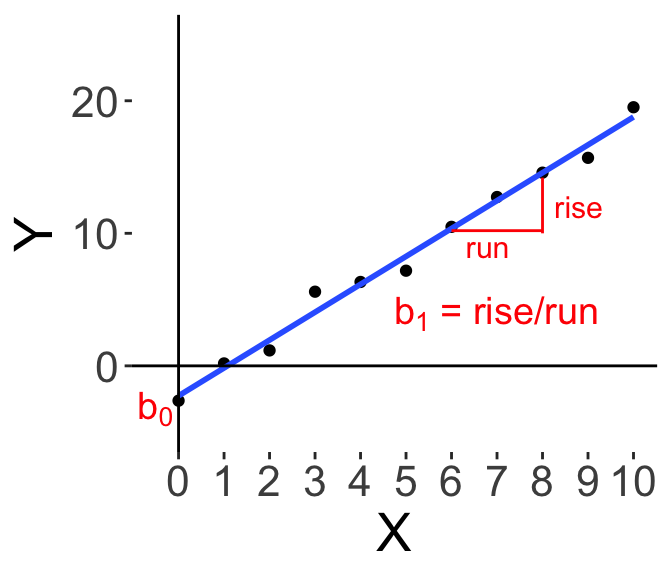
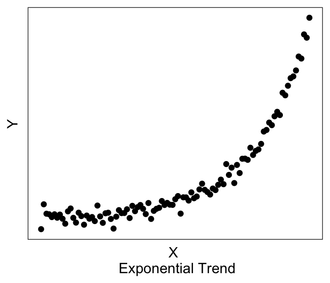
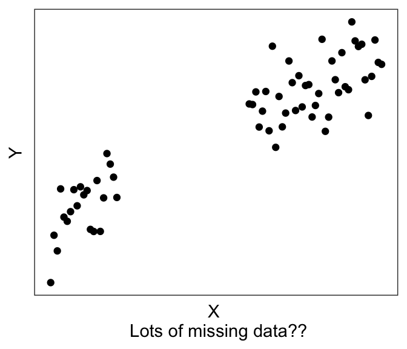
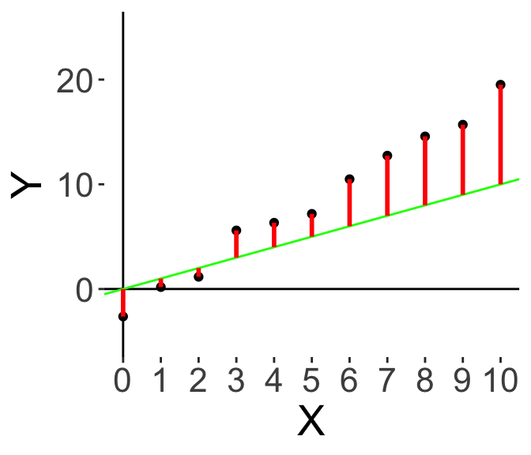
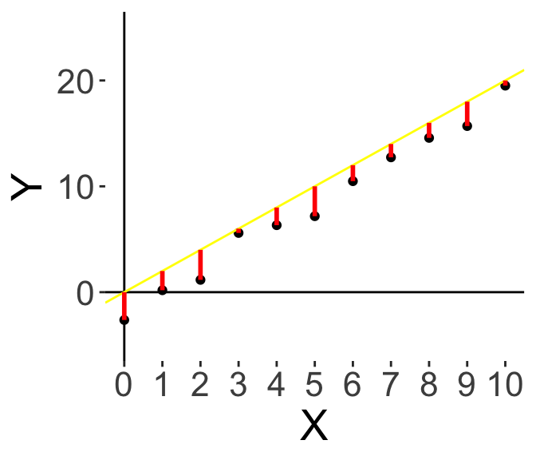

# The Linear Model I: Linear Regression


In this chapter we will learn about a workhorse tool of analytics: the linear model, which allows us to run linear regression models that we can use to estimate simple trends and look at how some variables in our data may affect other variables. We will be going over how to interpret the output of a regression model. 


The learning objectives for this chapter are:

- Readers should be able to understand and be able to use both simple and multiple regression to estimate simple trends.

- Readers should be able to interpret the output of a regression model, including regression coefficients, confidence intervals, hypothesis testing about coefficients, and goodness-of-fit statistics.


```r
# Load the libraries we'll use in this chapter
library(ggplot2) # for plotting
```


## [Not Done Yet] Introduction to the Linear Model


```
intro
```


## Basics of Linear Regression

Linear Regression really boils down to this simple equation. 

$$ Y = b_0 + b_1 X $$

We want to predict $Y$, our outcome variable or **dependent variable (DV)**, using $X$, which can have several names, like **independent variable (IV)**, predictor or regressor.

$b_0$ and $b_1$ are *parameters* that we have to estimate in the model: $b_0$ is the Constant or *Intercept* term, and $b_1$ is generally called a regression coefficient, or the slope.

Below, we have a simple graphical illustration. Let's say I have a dataset of $X$ and $Y$ values, and I plot a scatterplot of $Y$ on the vertical axis and $X$ on the horizontal. It's convention that the dependent variable is always on the vertical axis. 

On the right I've also drawn the "best-fit" line to the data. Graphically, $b_0$ is where the line crosses the vertical axis (i.e., when $X$ is 0), and $b_1$ is the slope of the line. Some readers may have learnt this in high school, where the slope of the line is the "rise" over the "run", so how many units of "Y" do we increase ('rise') as we increase "X".




And that's the basic idea. Our linear model is one way of trying to explain $Y$ using $X$, which is by multiplying $X$ by the regression coefficient $b_1$ and adding a constant $b_0$. It's so simple, yet, it is a very powerful and widely used tool, and we shall see more over the rest of this chapter and the next few chapters.


Our dependent variable $Y$ is always the quantity that we are interested in and that we are trying to predict. Our independent variables $X$ are variables that we use to predict $Y$.

Here are some examples:

Dependent Variable <br> Y | Independent Variable <br> X
--- | ---
Income | Years of Education
Quartly Revenue | Expenditure on Marketing
Quantity of Products Sold | Month of Year
Click-through rate | Colour of advertisement <br>(Note that this is an experiment!)

Perhaps we are interested in predicting an individual’s income based on their years of education. Or for a company, we might want to predict Quarterly Revenue using the amount we spent on Marketing, or predict sales at in different months of the year.

We can also use regression to model the results of experiments. For example, we might be interested in whether changing the colour of an advertisement will affect how effective it is, measured by how many people click on the advertisement (called the click-through rate, measuring how many people click on our ad). So we may show some of our participants the ad in blue, some in green, etc, and then see how that affects our click-through rate. So linear modelling can and is frequently used to model experiments as well.


Independent Variables can be **continuous** (e.g., Years; Expenditure), or they can also be **discrete**/**categorical** (e.g., Month, Colour, Ethnicity). And we shall see examples of both in this chapter

Similarly, Dependent Variables can either be **continuous** or **categorical**. In this Chapter we shall only cover continuous DVs, and we shall learn about categorical DVs in the next Chapter on Logistic Regression.


## Running a regression


The first step to running a regression is to be clear about what is your dependent variable of interest, and what are your independent variables. 

The second step is to structure your data. 
For most Linear Regression (at least for the examples in this Chapter), we almost always want `wide`-form data, discussed in the earlier Chapter on data handling, where you have each row of the data frame be one observation, and you have one column for $Y$ and one column for $X$. (In later Chapters we shall see when we may need `long`-form data for other types of regression.)

```
[todo:] example of wide form?
```


The third step is to visualize your data, discussed also in the earlier Chapter on Data Visualization. For regression analyses, visualization of your data allows you to see whether there may be linear trends or non-linear trends (or no trends).



Linear models assume that there exists a linear trend (or perhaps no trend) between $Y$ and $X$. If you have a non-linear trend, like the quadratic and exponential ones shown here, you may want to think about transforming some of your variables to see if you can get a linear trend before running the linear model.




Plotting can also help with troubleshooting. For example, you’ll be able to immediately see if you accidentally have a factor instead of a numeric variable, or if you have possible outliers (like the graph on the left) or possibly missing data (like the graph on the right).


Finally, we're ready to run the model. And in fact, it's one line of code. `lm` for linear model, and then you provide an "equation", `y~x`, which is R syntax for "Y depends upon X". And then finally put


```r
# running a Linear Model
fit1 <- lm(y~x, df1)
```


> <span style='color:blue; font-size:150%'>TIP!</span> 
> Best analysis practice: If you store all your Y and X variables in your data frame as wide form data, you can just write `lm(y~x, df1)`, which is very neat.
> <br> It's not as clean to write `lm(df1$y~df1$x)`, and I discourage this.


Then, we can just call `summary()` on our lm object, in order to view the output of the model.


```r
# examining the output
summary(fit1)
```

```
## 
## Call:
## lm(formula = y ~ x, data = df1)
## 
## Residuals:
##     Min      1Q  Median      3Q     Max 
## -1.0781 -0.5736  0.1260  0.3071  1.5452 
## 
## Coefficients:
##             Estimate Std. Error t value Pr(>|t|)    
## (Intercept) -2.26117    0.46171  -4.897 0.000851 ***
## x            2.10376    0.07804  26.956 6.44e-10 ***
## ---
## Signif. codes:  0 '***' 0.001 '**' 0.01 '*' 0.05 '.' 0.1 ' ' 1
## 
## Residual standard error: 0.8185 on 9 degrees of freedom
## Multiple R-squared:  0.9878,	Adjusted R-squared:  0.9864 
## F-statistic: 726.6 on 1 and 9 DF,  p-value: 6.442e-10
```


There's a lot of information here, which we will break down in the next few sections, after a short digression to discuss Ordinary Least Squares regression.


## Ordinary Least Squares Regression

Let's take a quick peek behind what the model is doing, and we'll discuss the formulation of **Ordinary Least Squares** regression. 

Let's assume that the "true" model is such that $Y$ is $b_0$ + $b_1$\*$X$ plus some "errors", which could be due to other, unmeasured factors, or maybe just random noise.

$$ \text{``True" model: } Y = b_0 + b_1 X + \epsilon $$ 

Within a linear regression, we are making the assumption that the errors are Normally distributed around zero with some variance. (So $\epsilon \sim \mathscr{N}(0, \sigma)$).

Since we don't know the "true" $b_0$ and $b_1$, we can only choose $\hat{b_0}$ and $\hat{b_1}$; using this we can compute the prediction of our model, $\hat{Y}$. We want our $\hat{b_0}$ and $\hat{b_1}$ to be as close to the "true" $b_0$ and $b_1$, which will also make our predictions $\hat{Y}$ as close to the actual $Y$.

To do this, we define the Residual or **Residual Error** of our model. For the $i$-th data point, the residual is the difference between the actual $Y_i$ and our model predicted, $\hat{Y_i}$. 

$$ \text{Residual Error: } e_i = Y_i - \hat{Y_i} $$


Here's an illustration. Let's say I start off just by drawing a green line through the origin with some upward slope. 




Here, the red lines illustrate the residual error; the difference between the actual value and our prediction. And to make our model better, we want to minimise the red bars.
Some red bars are lower, some are higher, so let’s pivot the slope upwards.




Now, we have this yellow line. It looks better, overall the bars are smaller. Now we note that all the red bars are below, so instead of pivoting, let’s move the whole line down.


And finally we get the blue line here, which is the best solution to minimising the red bars. We want to minimise the residuals. How is this done?


### Ordinary Least Squares Derivation

The residuals can be positive or negative, so if we simply add the residuals up we might be cancelling out some of them. So instead of minimising the sum of the residuals, we usually choose to square the residuals and minimise the sum of squares of the residuals. (Mathematically it becomes easier to work with the square than the absolute value). 

So here, we have the Ordinary Least Squares Regression, where the goal is to choose  $\hat{b_0}$ and $\hat{b_1}$ to minimise the sum of squares of the residuals $\sum_{i} e_i^2 = \sum_i \left( Y_i - \hat{Y_i} \right)^2$.


We can do this by taking the partial derivative with respect to $\hat{b_0}$ and $\hat{b_1}$, and setting them both to 0. First, we define the following variables to simplify notation:

\begin{align}
\text{Define } \bar{Y} &\equiv \frac{1}{n}\sum_i^n Y_i \\
\text{Define } \bar{X} &\equiv \frac{1}{n}\sum_i^n X_i \\
\text{Define } Z &\equiv \sum_i \left( Y_i - \hat{Y_i} \right)^2 \\
&= \left( Y_i - \hat{b_0} - \hat{b_1} X \right)^2 \\
\end{align}

Then we take the partial derivative with respect to $\hat{b_0}$, solve for this $\hat{b_0}$, then substitute it into the partial deriative with respect to $\hat{b_1}$:
\begin{align}
\text{Partial deriative w.r.t. } \hat{b_0} : \; \; 
\frac{\partial Z}{\partial \hat{b_0}} &= \sum_i^n -2 \left(Y_i - \hat{b_0} - \hat{b_1}X_i \right) \\
\text{Setting the derivative to 0 and solving, we have: } \; \;
\hat{b_0} &= \frac{1}{n}\sum_i^n Y_i - \frac{1}{n}\sum_i^n\hat{b_1}X_i \\
\implies \hat{b_0} &= \bar{Y} - \hat{b_1} \bar{X} \\
\text{Partial deriative w.r.t. } \hat{b_1} : \; \;\frac{\partial Z}{\partial \hat{b_1}} &= \sum_i^n  -2X_i \left( Y_i - \hat{b_0} - \hat{b_1}X_i \right) 
\end{align}
\begin{align}
\text{Setting the derivative to 0 and substituting $\hat{b_1}$, we have: } & \\
\sum_i^n X_i Y_i - \sum_i^n (\bar{Y}-\hat{b_1}\bar{X})X_i - \sum_i^n\hat{b_1}X_i^2 &= 0 \\
\sum_i^n X_i Y_i - \bar{Y} \sum_i^n X_i + \hat{b_1} \left(\bar{X} \sum_i^n X_i - \sum_i^n X_i^2 \right) &= 0 \\
\hat{b_1} &= \frac{\sum_i^n X_i Y_i - \bar{Y}\sum_i^n X_i }{ \sum_i^n X_i^2 - \bar{X} \sum_i^n X_i } \\ &= \frac{\sum_i^n X_i Y_i - n\bar{X}\bar{Y}}{ \sum_i^n X_i^2 - n\bar{X}^2} \\
\text{simplifying: } \; \; \hat{b_1} &= \frac{\sum_i^n (X_i - \bar{X})(Y_i - \bar{Y})}{ \sum_i^n (X_i - \bar{X})^2 }
\end{align}

And we end up with the final OLS solution:

\begin{align}
\hat{b_0} &= \bar{Y} - \hat{b_1} \bar{X} \\
\hat{b_1} &= \frac{\sum_i^n (X_i - \bar{X})(Y_i - \bar{Y})}{ \sum_i^n (X_i - \bar{X})^2 } = \frac{Cov(X,Y)}{Var(X)}
\end{align}

The good news is that $R$ already does this for you. Let's check this solution with the `lm()` model we fit on the previous page!

Let's do $\hat{b_1}$ first: in R, we can calculate the covariance of $X$ and $Y$, and divide that by the variance of $X$, and save that into b1-hat: for this dataset we get 2.10. 


```r
b1hat = cov(df1$x, df1$y) / var(df1$x)
b1hat
```

```
## [1] 2.103757
```

Following the equation for $\hat{b_0}$, we can take the mean of $Y$, and subtract $\hat{b_1}$ times the mean of $X$, and we get -2.26.


```r
b0hat = mean(df1$y) - b1hat * mean(df1$x)
b0hat
```

```
## [1] -2.261167
```


Finally let's go back to our regression output table, which we can summon using `summary(...)$coeff`. 


```r
fit1 <- lm(y~x, df1)
# verifying the OLS solution
summary(fit1)$coeff
```

```
##              Estimate Std. Error   t value    Pr(>|t|)
## (Intercept) -2.261167 0.46170984 -4.897376 8.50721e-04
## x            2.103757 0.07804321 26.956313 6.44250e-10
```

We can see that the Estimate of the Intercept, i.e., $\hat{b_0}$, is -2.26, and the Estimate of the Coefficient on $X$, i.e., $\hat{b_1}$, is 2.10. They agree exactly! Excellent. So our `lm()` is really doing OLS regression.


Again, since $R$ does all the calculations for you, it's not necessary to know how to derive the OLS solutions (especially with more than 1 $X$), but it is handy to know the intuition behind it, especially when we get to more complicated regression.


## [Not Done:] Interpreting the output of a regression model


### [Not Done:]  The coefficient table


### [Not Done:]  Goodness-of-fit statistics


## [Not Done:]  Assumptions behind Linear Regression


## Multiple Linear Regression

We’ve covered Simple Linear Regression, whereby "Simple" means just one independent variable. Next we’ll talk about Multiple Linear Regression, where "Multiple" just means multiple independent variables.

$$Y = b_0 + b_1X_1 + b_2X_2 + b_3X_3 + \ldots$$ 

This is actually quite a straightforward extension, once we get the hang of the interpretation. We can simply extend our linear model to also include $X_2$, $X_3$ and so forth, and now our $b_1$ is called the coefficient on $X_1$ or the partial coefficient on $X_1$.

Here’s the most difficult part.

> When we interpret each partial coefficient, the value is interpreted *holding all the other IVs constant*. So $b_1$ represents the expected change in Y when $X_1$ increases by one unit, holding constant all the other variables.

This is so important that I'll say it twice more. If you really understand this point, then you know how to do multiple regression.


>The partial regression coefficients represent the expected change in the dependent variable when the associated independent variable is increased by one unit while the values of all other independent variables are held constant. 


And a third time, in different words:


>Each coefficient $b_i$ estimates the mean change in the dependent variable ($Y$) per unit increase in $X_i$, when all other predictors are held constant.


Here's an example

$$\text{Profit} = -2000 + 2.5* \text{ExpenditureOnAdvertising} +32*\text{NumberOfProductsSold}$$

Coefficient | Intepretation:
--- | ---
(b0) | Monthly profit is -\$2000 without any money spent on advertising and with zero products sold.
(b1) | Holding the number of products sold constant, every dollar spent on advertising increases profit by \$2.50
(b2) | Keeping advertising expenditure constant, every product sold increases profit by \$32


## Standardized Coefficients


Let's take a short digression to discuss standardised coefficients. In all the examples in this Chapter, we've seen that it's very important to be clear about what the units of measurement are, as this affects how we interpret the numbers. 

For example, in $\text{Income} = b_0 + b_1 \text{YearsOfEducation}$, we can say for a 1 unit increase in $X_1$, so for one additional year of education, there is a $b_1$ unit increase in $Y$; so there is a \$$b_1$ increase in income.


Unfortunately, sometimes we may have difficulty comparing $X$'s. Perhaps I have a dataset of American students and their standardized test scores on the SATs, and a corresponding dataset of Singaporean students and their standardized test scores on the O-levels^[ignore the fact that the SAT and O-levels are at different levels]. I want to compare the datasets to predict how test scores ($X$) affect income ($Y$), but my $X$s here are on different scales. How should we compare them?

One way is by using standardised coefficients^[Confusingly, when we use standardised coefficients, it is the variables that get standardised, not the coefficients.]. 

To do so, we "standardize" each variable by subtracting its mean and dividing by its standard deviation. Then we just re-run the regression. Now, notice that I’ve replaced $b$'s with $\beta$s, and now these $\beta$s are unit-less. Or, to put it another way, they are in "standardized" units. By convention (although not everyone follows this), $b$ are used to refer to unstandardized regression coefficients while $\beta$s are used to refer to standardized regression coefficients.

$$\left[ \frac{Y-\bar{Y}}{\sigma_{Y}} \right] = \beta_0 + \beta_1 \left[ \frac{X_1 - \bar{X_1}}{\sigma_{X_1}} \right] + \beta_2 \left[ \frac{X_2 - \bar{X_2}}{\sigma_{X_2}} \right] + \ldots$$

* Note: We can choose to standardise only the IVs, or only some of the IVs. The usual convention is that all the IVs and sometimes the DV are standardised.


Now, the interpretation is:

> When $X_i$ increases by one standard deviation, there is a change in $Y$ of $\beta_i$ standard deviations

Example: if we run: $$\text{Income} = \beta_0 + \beta_1 \text{Education} + \beta_2 \text{Working Experience}$$ as a standardized regression, and we find that $\beta_1$ = 0.5, then the interpretation is:
“For every increase in education level by one standard deviation, holding working experience constant, there is an average increase in income by 0.5 standard deviations.”

With standardised coefficients, the interpretation changes, everything is now in standard deviations.


Sometimes, standardised coefficients makes it easier to interpret when the underlying unit is quite difficult to interpret, for example: IQ, the intelligence quotient, is actually a standardised variable itself such that 100 is the mean of the population and 15 is the standard deviation. It's hard to come up with units of "absolute" intelligence, and so IQ is actually measured relative to others in the population.

Coming back to the example of comparing the results in an American sample with the SAT and a Singaporean sample with the O-levels; even if I cannot compare 1 point on the SAT with 1 point on the O-levels, with standardized coefficients I can still ask: does a 1 standard deviation increase in SAT score have the same effect (on whatever $Y$), as a 1 standard deviation increase in O-level score?


Here is some R code to 'manually' standardize variables and use them in a model

```r
# unstandardized
lm(Y ~ X, df1)

# standardized
df1$X_standardized = scale(df1$X, center=TRUE, scale=TRUE)
df1$Y_standardized = scale(df1$Y, center=TRUE, scale=TRUE)

lm(Y_standardized ~ X_standardized, df1)
```


## Categorical Independent Variables

So far we have been dealing with continuous independent variables ($X$), (e.g. Expenditure, Years, Age, Numbers, ...). In this section, we consider categorical independent variables (e.g., Gender, Ethnicity, MaritalStatus, Color-Of-Search-Button, ...).

Let's consider an example modelling how Umbrella Sales depend upon Weather. 

$$\text{UmbrellaSales} = b_0 + b_1 \text{Weather}$$

These categorical variables take on one of a small set of fixed values. Let's assume in this simple world that weather is only Sunny or Rainy. 

### Dummy Coding

Dummy Coding (the default method in R) is a method by which we create and use dummy variables in our regression model^[Aside from dummy coding (R’s default), there are other coding schemes which can be used to test more specific hypothesis, e.g. effect coding, difference coding, etc. But here we shall focus on Dummy Coding.].


In this example, we can define a variable: `Rainy` that is 1 if `Weather==Rainy`, and 0 if `Weather==Sunny`.


`Rainy` is called a **dummy variable** (sometimes called an indicator variable)

We can replace `Weather` with the dummy variable `Rainy`:

$$\text{UmbrellaSales} = b_0 + b_1 \text{Weather} \; \rightarrow \; \color{brown}{\text{UmbrellaSales} = b_0 + b_1 \text{Rainy}}$$

Thus, this breaks down into two equations (technically, a piecewise equation):

- If Sunny, $\text{UmbrellaSales} = b_0 + b_1(0) = b_0$
- If Rainy, $\text{UmbrellaSales} = b_0 + b_1(1) = b_0 + b_1$


Now we can interpret the value of these coefficients. 
Looking at the first equation, we can see that $b_0$ is simply the average umbrella sales when it is sunny. And similarly, from the second equation, we see that $b_0$ **PLUS** $b_1$ is the average umbrella sales when it is rainy.


This means that $b_1$ is the **difference** between these equations: It is the average difference in umbrella sales when it is rainy, compared to when it is sunny.

The following table summarizes these interpretations:


Coefficient | Intepretation:
--- | ---
($b_0$) | Average Umbrella sales when it is Sunny
($b_0+b_1$) | Average Umbrella sales when it is Rainy
($b_1$) | Average difference in Umbrella sales when it is Rainy, **compared to** when it is Sunny <br> (Sales when Rainy - Sales when Sunny)


```
Q: Would you predict $b_1$ to be greater than 0 or less than 0?
```

### Dummy Coding with 3 levels


Let's now consider a more complicated world in which `Weather` can take one of three values: Sunny, Rainy, or Cloudy.

Then we can define two dummy variables, `Rainy` and `Cloudy`,

- `Rainy` = 1 if weather is rainy, 0 otherwise
- `Cloudy` = 1 if weather is cloudy, 0 otherwise

We say that Sunny is the **Reference Group** for the categorical variable `Weather`. 

$$\text{UmbrellaSales} = b_0 + b_1 \text{Rainy} + b_2\text{Cloudy}$$

This breaks down into three equations:

- If Sunny, $\text{UmbrellaSales} = b_0 + b_1(0) + b_2(0) = b_0$
- If Rainy, $\text{UmbrellaSales} = b_0 + b_1(1) + b_2(0) = b_0 + b_1$
- If Cloudy, $\text{UmbrellaSales} = b_0 + b_1(0) + b_2(1) = b_0 + b_2$

Just like above, we can interpret the meaning of the coefficients in the following table:

Coefficient | Intepretation:
--- | ---
($b_0$) | Average Umbrella sales when it is Sunny
($b_0+b_1$) | Average Umbrella sales when it is Rainy
($b_1$) | Average difference in Umbrella sales when it is Rainy, **compared to** when it is Sunny <br> (Sales when Rainy - Sales when Sunny)
($b_0+b_2$) | Average Umbrella sales when it is Cloudy
($b_2$) | Average difference in Umbrella sales when it is Cloudy, **compared to** when it is Sunny <br> (Sales when Cloudy - Sales when Sunny)


Thus, in general, a categorical variable with $n$ levels will have $(n-1)$ dummy variables. And the general interpretation of these $i$ dummy variables are:

Coefficient | Intepretation:
--- | ---
($b_0$) | Average Value of Y for the reference group.
($b_i$) | Average Difference in Y for Dummy Group i compared to the reference group.


### The Reference Group

Now, when we do dummy coding, one of the groups will automatically be the reference group. The choice of reference group is not fixed. And choosing your reference group well (depending on your goals) will make your analyses more convenient and interpretable.


For example, for the Umbrella Sales example (Sunny, Rainy, Cloudy), I think "Sunny" is a good reference group. Why?


Or let’s say I want to see how well people react to the color of the button on my webpage. So I run an experiment with the following four buttons^[This may seem frivolous, but Google actually ran a lot of these tests back in the day, with different shades of blue/green/red to settle on their current "Google colors".]:

- <span style="color:blue">Current Button</span>
- <span style="color:green">Button A</span>
- <span style="color:magenta">Button B</span>
- <span style="color:brown">Button C</span> 

Which should I choose to be my reference group? I think that "Current Button" should be the reference group, since that is the status quo and I am interesting in how changing the buttons would affect click-through, relative to my current button.

```
The good news: R handles dummy coding for you using factors.
You do not need to create your own dummy variables. Just run:
lm(sales ~ weather, df)
and if weather is a factor with n levels,
R will default to creating n-1 dummy variables 


The bad news: R does not know your hypotheses, so it uses a heuristic for 
choosing the reference group.
If you do not specify, R defaults to ranking the groups by alphabetical order.

Thus, in the weather example, it would choose "Cloudy", 
and in the button example, "Button A" as the reference group.

If your variable (df$var) is a factor, you can check by using
levels(df$var). 
The first level will be the reference group.

Use relevel(df$var, "desiredReferenceLevel") to adjust the reference group.

(if df$var is a character string, levels() will return NULL,
but if you put it into a lm(), R will treat it as categorical variable,
with the alphabetically smallest string as the reference group)
```


### Interpreting categorical and continuous independent variables

Whenever we have categorical independent variables in a model, interpreting the coefficients has to be done with respect to the reference group, even for other continuous independent variables.


Let's add a continuous variable to our 3-weather model.

- `UmbrellaSales` is a continuous variable measured in $.
- `Rainy` and `Cloudy` are dummy variables ("Sunny" is the reference group)
- `ExpenditureOnAdvertising` is also a continuous variable measured in $.

Let's say we fit the following model and obtain the following coefficients:

$$\text{UmbrellaSales} = 10 + 50 \text{Rainy} + 20 \text{Cloudy} + 2.5\text{ExpenditureOnAdvertising}$$

Here's how we interpret each of these coefficients:


Coefficient | Intepretation:
--- | ---
10 | Average umbrella sales when it is sunny and $0 spent on advertising.
50 | Average umbrella sales when it is rainy compared to sunny *and* $0 spent on advertising.
20 | Average umbrella sales when it is cloudy compared to sunny *and* $0 spent on advertising.
2.5 | When it is sunny, every dollar spent on advertising increases sales by $2.50


## [todo:] Discuss Transformations?


