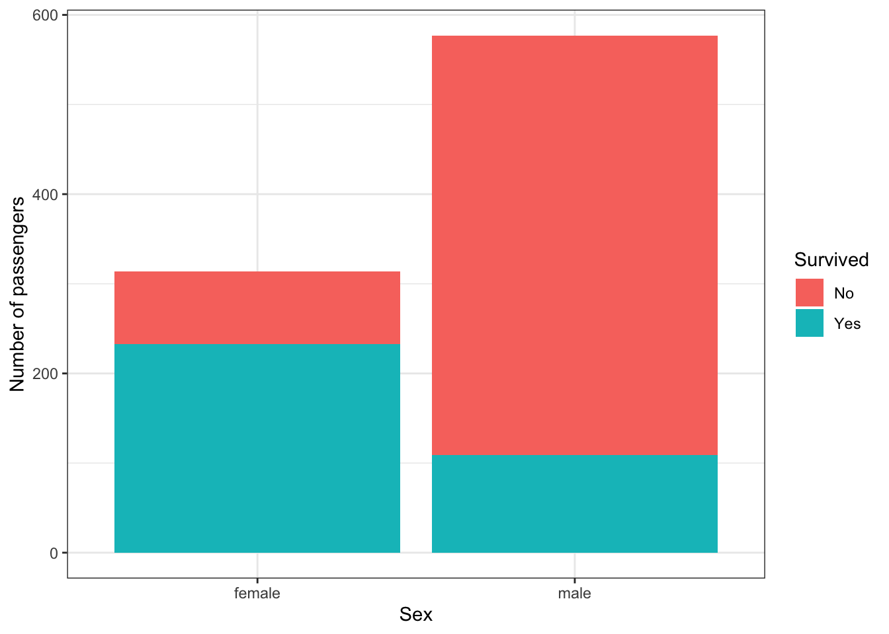

# The Linear Model II: Logistic Regression

<span class="badge badge-bt"> BT1101 </span>

In the previous chapter, we introduced the linear model, and showed how we can use it to model continuous dependent variables ($Y$), using a combination of both continuous and categorical indepdent variables ($X$).

In this chapter we will discuss expanding our toolkit to use a different type of regression, **logistic** regression, to model categorical dependent variables ($Y$). For now, we **only consider binary dependent variables** (such as `Yes`/`No` Decisions, `True`/`False` classifications, etc), although there are also extensions to categorical dependent variable with multiple levels (e.g., multinomial regression).


The learning objectives for this chapter are:

- Readers should understand and be able to use logistic regression to estimate categorical dependent variables (e.g., to perform classification).


```r
# Load the libraries we'll use in this chapter
library(tidyverse)
```


## Basics of Logistic Regression

<span class="badge badge-bt"> BT1101 </span>

Let's imagine that we have a dataset with individual yes/no decisions, that we want to predict. For example, we might have a dataset of individual consumer purchases on an e-commerce platform, where we want to predict a consumer’s decision to purchase a product based upon other variables such as how much they spend on the platform, what their demographics are^[Another common example: we might want to predict people's voting behaviour or willingness to support certain policies, based upon certain characteristics.].

Here, our dependent variable is whether or not the customer purchased the product, so just "Yes" or "No", and we can write the model with this Purchased variable on the left hand side. Can we build a linear model to predict purchasing behaviour?

$$\text{Purchased} \sim \text{Spending} + \text{Demographics} + \ldots$$


Unfortunately, here we cannot use linear regression, because our response variable is a binary (yes/no) variable, while the linear regression model assumes a variable with normally distributed errors. But we can use the `generalized linear model`, which, as its name suggests, generalizes the linear model to other types of variables. The idea is that the GLM introduces a _link_ function that maps the actual response variable `Y` to what the linear model predicts.

Here we'll focus on `logistic regression`, which uses the `logit` function as its link function. 

Let $p$ be the probability that Purchase = 1 (i.e., "Yes")^[In general, $p$ is the probability that the dependent variable takes on a particular value of interest (e.g., "success"). R treats binary outcome variables as factors, where the first level (e.g. `0`, `FALSE`, `No`) is the base, comparison group and the second level (e.g., `1`, `TRUE`, `Yes`) is the "success" group. As with categorical independent variables, you can use `levels(df$var)` to check which level R will use as the base group by default.]. Then the logistic regression equation becomes:


$$\text{logit}(p) = b_0 + b_1 X_1 + \ldots$$

Thus, instead of predicting a continuous outcome variable $Y$ directly, we instead predict the log-odds of an event occurring:

$$ \text{logit}(p) \equiv \log \frac{p}{1-p}$$

This term is called the log-odds, where $\frac{p}{1-p}$ is called the "odds" or "odds-ratio". To be clear, the logit is defined using the natural (base-$e$) logarithm, not the base-10 logarithm.


The difference between the equation for linear regression (in the previous chapter) and logistic regression is summarized in the following table:

Name | Equation
--- | ---
Linear Regression | $$Y = b_0 + b_1 X_1 + \ldots$$
Logistic Regression | $$\text{logit}(p) = b_0 + b_1 X_1 + \ldots$$

In fact, linear regression is a special case of the general linear model with the identity function as the link function.


## Running a Logistic Regression

<span class="badge badge-bt"> BT1101 </span>

The syntax for running a logistic regression is almost the same as a linear regression, just that the call is `glm()` for **g**eneral **l**inear **m**odel, with an additional specification of `family = binomial`, which tells `glm` to run logistic regression. (Other `family` options produce other types of general linear regression, such as probit regression, etc.)

Now, the good news is that R handles a lot of this complication for you, when it can. For example, we **do not** have to manually calculate the odds ourselves. All we have to do is make sure our variable is a binary factor, then we can just call `glm()`. 


> Note that, just like categorical IVs, when we do logistic regression with a categorical DV, we also have a **reference group**, so do use the `levels()` function to check.

Let's generate a simple dataset with two independent variables $X_1$ and $X_2$, and use them to predict $\text{Purchase}$, a binary yes/no variable.


```r
# logistic
set.seed(1)
df2 = data.frame(x1=rnorm(20,0,5) + seq(20,1),
                 x2=rnorm(20,5,3),
                 Purchase = factor(rep(c("Yes", "No"), each=10)),
                                   levels=c("No", "Yes"))
levels(df2$Purchase) 
```

```
## [1] "No"  "Yes"
```

```r
## This means that "No" is the `base group`, and `p` is the probability of "Yes".
```


```r
# next, running a logistic regression via a general linear model
fit_log1 <- glm(Purchase ~ x1 + x2, family="binomial", df2)
summary(fit_log1)
```

```
## 
## Call:
## glm(formula = Purchase ~ x1 + x2, family = "binomial", data = df2)
## 
## Deviance Residuals: 
##      Min        1Q    Median        3Q       Max  
## -1.96587  -0.37136   0.00399   0.54011   1.64780  
## 
## Coefficients:
##             Estimate Std. Error z value Pr(>|z|)  
## (Intercept)  -4.0054     2.4320  -1.647   0.0996 .
## x1            0.3954     0.1653   2.393   0.0167 *
## x2           -0.1281     0.3062  -0.418   0.6758  
## ---
## Signif. codes:  0 '***' 0.001 '**' 0.01 '*' 0.05 '.' 0.1 ' ' 1
## 
## (Dispersion parameter for binomial family taken to be 1)
## 
##     Null deviance: 27.726  on 19  degrees of freedom
## Residual deviance: 14.597  on 17  degrees of freedom
## AIC: 20.597
## 
## Number of Fisher Scoring iterations: 6
```


The summary output looks almost the same too as a `lm()` call. Let’s focus on the coefficient table, and reproduce the regression equation to help us in the interpretation.


$$\text{logit}(p) \equiv \log\frac{p}{1-p} = b_0 + b_1 X_1 + b_2X_2$$

Just like in linear regression, $b_0$ is the mean value of the left-hand-side when all the $X$ on the right hand side are zero. Hence, $b_0$ is the log-odds of the event occurring when $X_1$ and $X_2$ are both zero (this part is the same as what we’ve covered previously). So this means that when $X_1$ and $X_2$ are both zero, the log-odds of purchasing an item is -4.005. Conversely, we can also say that the odds of purchasing this item is `exp`(-4.005), or 0.018. 
This means that $\frac{p}{1-p}$ is 0.018.

Next, let's move onto $b_1$. $b_1$ is the expected increase in log-odds per unit increase of $X_1$, holding $X_2$ constant. This is the same as linear regression. 

And similarly, $b_2$ is the expected increase in log-odds per unit increase of $X_2$, holding $X_1$ constant. Note that $b_2$ is negative, so increasing $X_2$ will decrease the log-odds. (But in this case, it's not significant anyway)

Now, let's take some numbers to build intuition. Every unit-increase of $X_1$ increases the log-odds by 0.3954. Conversely, every unit-increase of $X_1$ multiplies the odds by exp(0.3954) = 1.48. i.e., the odds increase by 48%

- Check: When $X_1$ and $X_2$ are 0, the odds are `exp`(-4.005) = 0.0182. 
- If we now increase $X_1$ to 1, the odds are now `exp`(-4.005 + 0.395), or 0.0271.
- The odds have increased by (0.0271-0.0182)/0.0182 ~ 48\% (if we kept more decimal places)

For example, if $X_1$ is "Number of A-list celebrities endorsing your product", then getting one additional celebrity endorsement would, in expectation, increase each customer’s odds of purchasing your product by 48\%. (not increasing probability, but odds)


This table summarizes the interpretations:

Coefficient | Interpretation
--- | ---
($b_0$) | Log-odds when $X_1$ and $X_2$ are both zero. Odds of purchasing = exp(-4.0054) = 0.018
($b_1$) | Expected increase in log-odds of event per unit-increase of $X_1$, holding $X_2$ constant.
($b_2$) | Expected increase in log-odds of event per unit-increase of $X_2$, holding $X_1$ constant.


The rest of the coefficient table is the similar to the `lm()`. However, instead of these coefficients following a $t$ distribution, they follow a $z$ distribution. The interpretation of the standard error, $z$ values, and $p$ values are similar. Thus, in this table, the coefficient $X_1$ is statistically significant at the $\alpha=0.05$ confidence level ($p<.05$)


## Examples: Logistic Regression

Let's consider a classic dataset from the ill-fated maiden voyage of the RMS Titanic in 1912, which is available in `R`. First let's load in the `R` package (`library(titanic)`, installing it if it doesn't already exist on your system), and use the data frame called `titanic_train`. We first inspect the data frame to get a sense of the variables.


```r
# install.packages('titanic') ## run if not already installed
library(titanic)
```

```
## Warning: package 'titanic' was built under R version 4.0.2
```

```r
## let's use the dataset called titanic_train
# inspect the first two rows: we see the data frame has variables PassengerId, Survived, Pclass, Name, Sex, Age, SibSp, Parch, Ticket, Fare, Cabin, and Embarked
head(titanic_train, 2)
```

```
##   PassengerId Survived Pclass
## 1           1        0      3
## 2           2        1      1
##                                                  Name    Sex Age SibSp Parch
## 1                             Braund, Mr. Owen Harris   male  22     1     0
## 2 Cumings, Mrs. John Bradley (Florence Briggs Thayer) female  38     1     0
##      Ticket    Fare Cabin Embarked
## 1 A/5 21171  7.2500              S
## 2  PC 17599 71.2833   C85        C
```

```r
# check how many rows
nrow(titanic_train)
```

```
## [1] 891
```

```r
# check distribution of the Survived and Sex variables
table(titanic_train$Survived)
```

```
## 
##   0   1 
## 549 342
```

```r
table(titanic_train$Sex)
```

```
## 
## female   male 
##    314    577
```

So we can see that the dataset contains 891 observations (passengers) with 12 variables. We'll just look at a few of these variables. 

Of these 891 passengers, 342 passengers survived the sinking of the Titanic (`Survived=1`), while 549 did not (`Survived=0`). And of these 891 passengers, 314 were female (`Sex="female"`), while 577 were male (`Sex="male"`). 

Let's estimate a model to predict `Survived` from `Sex` and `Age`. That is, can we predict a passenger's chance of survival given their sex and age?

First, as usual let's visualize our data

How do we visualize `Survived`, which is a binary variable that takes on values \{`0`, `1`\}, as well as Sex, which is another binary variable that takes on values \{`male`, `female`\}? There are many different types of visualizations, but below we'll use a stacked bar plot:


```r
# munging, then plotting 
titanic_table <- titanic_train %>% 
                  group_by(Survived, Sex) %>% 
                  summarize(number=n()) %>% 
                  mutate(Survived = factor(Survived, 
                                           levels=c(0,1), labels=c("No", "Yes")))
```

```
## `summarise()` regrouping output by 'Survived' (override with `.groups` argument)
```

```r
ggplot(titanic_table, aes(x=Sex, y=number, fill=Survived)) + 
  geom_bar(stat = "identity") + ylab("Number of passengers") + theme_bw()
```



The blue bars show the number of passengers who survived, and red indicates the number of passengers who did not survive. On the left we plot female passengers, and on the right, male passengers. 

So first, we notice (i) there were more male passengers than female passengers, (ii) that of the female passengers, there were more passengers that survived than passengers than did not survive (blue bar is larger than the red bar), and (iii) of the male passengers, there were more passengers that did not survive than those who did (red bar is larger than blue bar).


Ok on to the actual regression. Let's estimate the model and inspect the summary of the model:


```r
# running a logistic regression via a general linear model
fit_log1 <- glm(Survived ~ Sex + Age, family="binomial", titanic_train)

summary(fit_log1)
```

```
## 
## Call:
## glm(formula = Survived ~ Sex + Age, family = "binomial", data = titanic_train)
## 
## Deviance Residuals: 
##     Min       1Q   Median       3Q      Max  
## -1.7405  -0.6885  -0.6558   0.7533   1.8989  
## 
## Coefficients:
##              Estimate Std. Error z value Pr(>|z|)    
## (Intercept)  1.277273   0.230169   5.549 2.87e-08 ***
## Sexmale     -2.465920   0.185384 -13.302  < 2e-16 ***
## Age         -0.005426   0.006310  -0.860     0.39    
## ---
## Signif. codes:  0 '***' 0.001 '**' 0.01 '*' 0.05 '.' 0.1 ' ' 1
## 
## (Dispersion parameter for binomial family taken to be 1)
## 
##     Null deviance: 964.52  on 713  degrees of freedom
## Residual deviance: 749.96  on 711  degrees of freedom
##   (177 observations deleted due to missingness)
## AIC: 755.96
## 
## Number of Fisher Scoring iterations: 4
```

Let's interpret the coefficients. Let's write out the equation: $$\text{logit}( \text{Survived} ) = b_0 + b_\text{Sex} X_\text{Sex} + b_\text{Age} X_\text{Age}$$

- where $X_\text{Sex}$ is a binary variable. Recall that `R` uses dummy coding, and from inspecting the summary we can also see that `female` is the reference group, so `X_\text{Sex} = 1` if male and `0` if female.
- and $X_\text{Age}$ is a real-valued number. 


If we plug the numbers in, we get: 

$$\text{logit}( \text{Survived} ) = 1.2773 - 2.4659 X_\text{Sex} - 0.0054 X_\text{Age}$$

So let's interpret:

- (intercept, or $b_0$): Log-odds of `Survived` when $X_\text{Sex}$ and $X_\text{Age}$ are both zero.
    - In English: The predicted odds of survival of a female, 0-year old person = $exp(1.2773) = 3.59$.
- ($b_\text{Sex}$): Expected increase in log-odds of `Survived` when $X_\text{Sex}$ becomes 1, holding $X_\text{Age}$ constant.
    - In English: A male passenger, compared to a female counterpart of the same age, has a decreased log-odds of survival of 2.466 ($b_\text{Sex}$)
    - Alternatively, being male would multiplies the odds of survival by $exp(-2.466) = 0.085$. Thus the odds of survival for males decrease to 0.085x that of females.
        - i.e., holding age constant, male passengers' odds of survival are 0.085 times that of female passengers.
    - Let's plug some numbers in to check: 
        - When $X_\text{Sex}$ and $X_\text{Age}$ are 0, the odds are $exp(1.277) = 3.59$
        - If we now increase $X_\text{Sex}$ to 1, the odds are now $exp(1.277 -2.466) = 0.305$
        - The odds have decreased by $(0.305)/3.59 \sim 0.085$ times
    - Note that we can discuss the coefficient interpretations in terms of log-odds, or odds. But these numbers do not reflect probability!
- ($b_\text{Age}$): Expected increase in log-odds of event per unit-increase of $X_\text{Age}$, holding $X_\text{Sex}$ constant.
    - Try writing this interpretation out in English!


## Exercises: Linear Model II
<span class="badge badge-bt"> BT1101 </span>

For this logistic regression, we want to predict whether a customer made a purchase (binary yes/no):

$$\text{logit}( \text{Purchased} ) = b_0 + b_1 \text{Years of Education} + b_2 \text{Gender}$$

$\text{Years of Education}$ is a continuous variable, and $\text{Gender}$ = 1 if Female, 0 if Male

We find that $b_0$ = -2.0, $b_1$ = 0.3 and $b_2$ = 0.5. 

- What are the units? 
- What do these coefficients mean?


