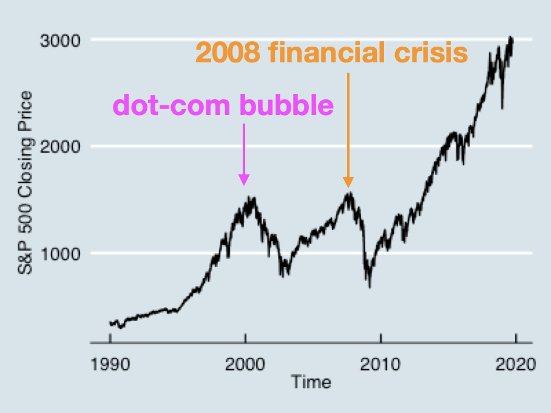
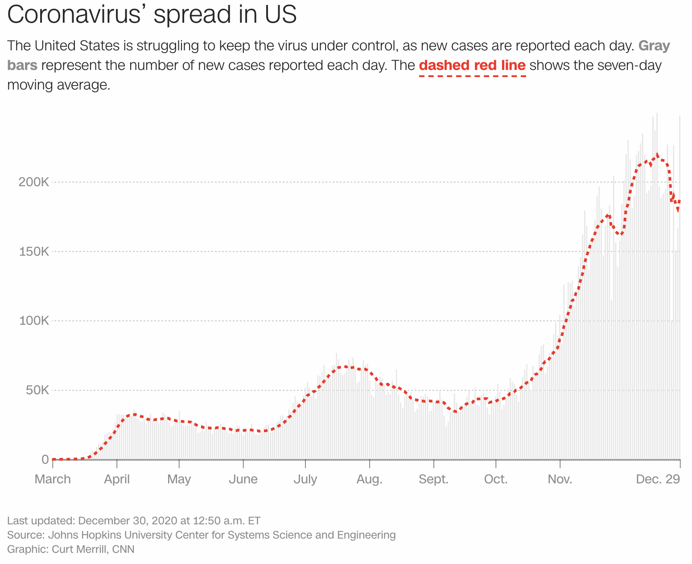

# Introduction to Time-Series Data {#time-series}


<span class="badge badge-bt"> BT1101 </span>


In this chapter we look at time-series data, which is also another fairly common type of data. Time-series data is data for one or more variables that vary across time, which we can denote as $Y_t$ to indicate the $Y$ variable at time $t$. 

In principle, we can use many different predictors in a time-series model:

$$ Y_t = b_0 + b_1 Y_{t-1} \\ + b_2 X_2 + ... $$
where we can use the outcome variables at previous time-steps ($Y_{t-1}, ...$), or we can also use regressors at the current (or previous) time-steps ($X_t, ...$).
We'll be covering smoothing-based time-series models (the former), as well as modelling time-series data using regression models.


The learning objectives for this chapter are:

- Readers should be able to understand and be able to use simple time-series models, such as the Moving Average, Exponential Smoothing, and Holt-Winters models.

- Readers should be able to understand concepts important to time-series modelling, such as trends and seasonality, lagged analyses.

- Readers should be able to apply time-series variables in regression analyses. 


## Time Series Basics 


First, let’s introduce some useful terminology that we can use to describe time-series data.


- **Trend**: a gradual upward or downwards movement of a time series over time.

- A **Seasonal** effect: an effect that occurs/repeats at a fixed interval 
    - Could be at any time-scales 
    - Examples: Diurnal temperature, temperature and length of day in temperate climates, "holiday season sales" that occur at specific times in the year

- **Cyclical** effects: longer-term effects that do not have a fixed interval/length 
    - Example: stock market "boom/bust cycles".
    - The difference between **cyclical** and **seasonal** effects is that the latter are predictable, in that they repeat at regular intervals.

- **Stationarity**: when statistical properties of the time-series (e.g., mean, variance) do not change over time.
    - So by definition, a stationary time-series has no trend.
    
- **Autocorrelation**: when a time-series is correlated with a past version of itself 
    - Auto here means "with itself", and so autocorrelation means that the signal Y is correlated with previous versions of itself.


Here are some examples to motivate how time-series data is interesting:


Here we have a dataset, which is in base R and which shows the monthly total of international airline passengers from 1949 to 1960. You can see that there is a gradual increase, but there is also this very stable pattern, going up and down over a year. Thus, this dataset shows a trend, and an obvious seasonal effect.




This is a graph showing the historical prices of the S&P500, a stock market index listed on the stock exchanges in the US, from 1990 until 2019. There are a lot of things going on, as is the case in real world data: There is a dramatic increase in price in the past 3 decades (trend), but also these large stock market fluctuations, or cycles.

The first of these cycles was the dot-com bubble in the 2000s, when tech companies were getting very hot, the internet was opening up, everyone was investing heavily in dot-com companies. The nature of these bubbles, however, is not that there is no value, but that the value is overestimated and actually doesn't match the risks or the actual return-on-investment. So when investors started realising this and when companies actually couldn't deliver as much as they promised, the bubble popped and the stock market crashed. This second cycle here precipitated what the 2008 financial crisis, and was actually due to overvalued mortgage loans in the US. Part of the American dream was to be able to own your own house in the suburbs; banks capitalized on this and started offering generous loans to people who couldn't really afford them, and who were in turn more likely to default on paying their loans. This resulted in a "housing bubble". When people actually started defaulting on their loans, the banks actually started losing money and some went bankrupt, and the whole worldwide economy was impacted. 





Finally, here's another time-series graph that is relevant given the Covid-19 pandemic. This screenshot, taken from CNN on Dec 30, 2020, contains the number of cases in the US up through Dec 29 of 2020. (I note that the data is publically available, while credits for this particular visualization goes to CNN.)
Similar to the stock market example, there is both an increasing trend, as well as several cycles.


## Smoothing-based models

Time-series data is often quite noisy, and often we may want to "smooth" out individual variation in the data, in order to be able to see the bigger picture, like trends.


First we define a simple moving average window, sometimes called a sliding window: we define a $k$-period simple moving average window as just the average of the most recent $k$ elements of the time-series: 

$$\text{Window}_t = \frac{1}{k} \left( Y_t + Y_{t-1} + \ldots + Y_{t-(k-1)} \right)$$


Note that the default for early timepoints (when there's not enough to fit in the window), is undefined, and in R is left as a missing, or NA value. There are several functions you can use to calculate these moving averages, here we use the SMA function from the TTR package:


```r
# There are many different ways to calculate simple moving averages. 
# Here's one from the TTR package
# install.packages('TTR')
library(TTR)
SMA(df$y, n=3) # taking window size of 3
```


This graph shows a simple time-series (in black), as well as the corresponding simple moving average windows of size 2 (in red) and size 4 (in brown). Take a minute to look at how the windows "smooth" out the variation in the data.


The CNN graph of covid cases on the previous page also has a seven-day moving average window overlaid on the raw data (which you can see in the faded bars). Notice how the red line makes it easier to see trends and cycles.


Here's another graph that is also related to Covid. This is a real graph of body temperature, taken twice a day. Now you might not be able to see much from this data because it's so noisy. But if we instead took a seven day moving average, we can see that this individual's temperature data seems to follow this repeated pattern. (And indeed, this individual happens to be a female, and this data does follow a repeated, biological seasonality.)


### Simple Moving Average Model

Now, a very simple model is to just use the window of recent values, as a prediction of the future. That is, we use the window to predict the value at the next time step: $$\hat{Y}_{t+1} = \text{Window}_t = \frac{1}{k} \left( Y_t + Y_{t-1} + \ldots + Y_{t-(k-1)} \right)$$


The major assumption in this model is that Y will stay the same, at least for short time-steps into the future. This assumes stationarity. And thus the simple moving average model does **not** account for trends, cycles, or seasons, and that we can get an estimate of the data just by averaging out some variation in the recent past. It's a relatively simple model that can be calculated very quickly, even using a pen and paper pad, and can be used for quick, short-range forecasting. For example, if you are running a small store and you are wondering how much of a product to stock up on, a good estimate would be the average of those products you sold over the past few weeks.


### Exponential Smoothing Models


The next model we'll consider is the single exponential smoothing model. This model has a parameter called $\alpha$. Our prediction for time $t+1$ is a weighted sum of the actual value of $Y_t$ and our model's prediction $\hat{Y}_t$. We can then subtitute in our prediction for $\hat{Y}_t$ in terms of $Y_{t-1}$ and $\hat{Y}_{t-1}$, and so forth.

$$\hat{Y}_{t+1} = \alpha Y_t + (1-\alpha) \hat{Y}_{t}
\\ = \alpha Y_t + (1-\alpha) \left( \alpha Y_{t-1} + (1-\alpha) \hat{Y}_{t-1} \right)
\\ = \alpha \left( Y_t + (1-\alpha) Y_{t-1} + (1-\alpha)^2 Y_{t-2} + \ldots \right)$$

Thus, we end up that our model's prediction for the next time point, $\hat{Y}_{t+1}$, contains a weighted sum of all previous time points $Y_t, Y_{t-1}, \ldots$. Because $\alpha$ lies between 0 and 1, as you go further back in time, each value gets less and less weight.

So notice that there are two main differences between the simple moving average and this: this model takes into account all past data (as opposed to a finite simple moving average window), and this model gives more weight to more recent values (as opposed to the same, uniform weight in a simple moving average window).

Unfortunately, this model still doesn't take into account trends or seasonality.

We can go further and consider a double exponential smoothing model, which can handle trends.

$$\hat{Y}_{t+k} = a_t + b_t k $$


Here we have just measured time $t$, and now we want to forecast forward to some $t+k$. The main idea here is that we have $Y_{t+k}$ made up of two components, the "intercept" component $a_t$ which "looks like" the single exponential model; and a second component, the "slope" $b_t$ which will help it to account for trends. 

$$a_t = \alpha Y_t + (1-\alpha) \left( a_{t-1} + b_{t-1} \right)$$

For the "slope" term, we have:

$$b_t = \beta \left( a_t - a_{t-1} \right) + (1-\beta) b_{t-1}$$
where we update the slope estimate using both ($a_t - a_{t-1}$), the current slope estimate, and $b_{t-1}$, the previous slope estimate.

The basic intuition is that each component is "smoothed" using the same linear combination ($\alpha, (1-\alpha)$) equation. The slope variable is also smoothed using a ($\beta, (1-\beta)$) equation. At every timestep we smooth and update our value of $a_t$ and $b_t$, using these parameters $\alpha, \beta$ and our estimates at the previous timesteps.


There is a further generalization of this to add a third application of exponential smoothing to model seasonality. This is called the Holt-Winters model. Luckily, R's HoltWinters() function can do all three types of exponential smoothing. The call is:


```r
HoltWinters(x, alpha, beta, gamma, ...)
```

The `R` function will allow you to specify $\alpha$, $\beta$, and $\gamma$, and whichever you do not specify it'll try to fit.


Method                         Trend   Seasonality   Parameters                                 Call                                    
-----------------------------  ------  ------------  -----------------------------------------  ----------------------------------------
Single Exponential Smoothing   No      No            alpha                                      HoltWinters(x, beta=FALSE, gamma=FALSE) 
Double Exponential Smoothing   Yes     No            alpha, beta (trend)                        HoltWinters(x, gamma=FALSE)             
Holt-Winters                   Yes     Yes           alpha, beta (trend), gamma (seasonality)   HoltWinters(x)                          


## [Not Done:] Regression-based forecasting models


