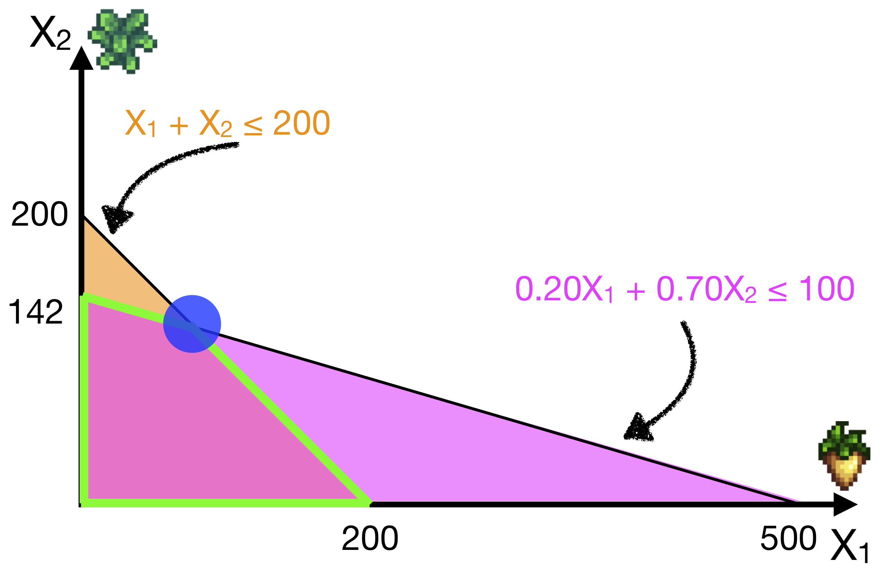
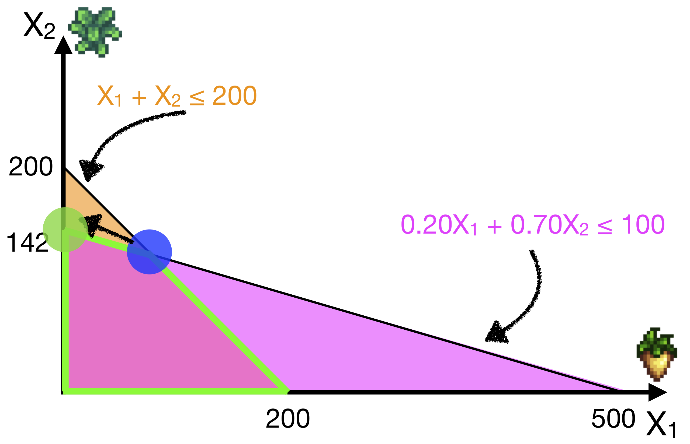
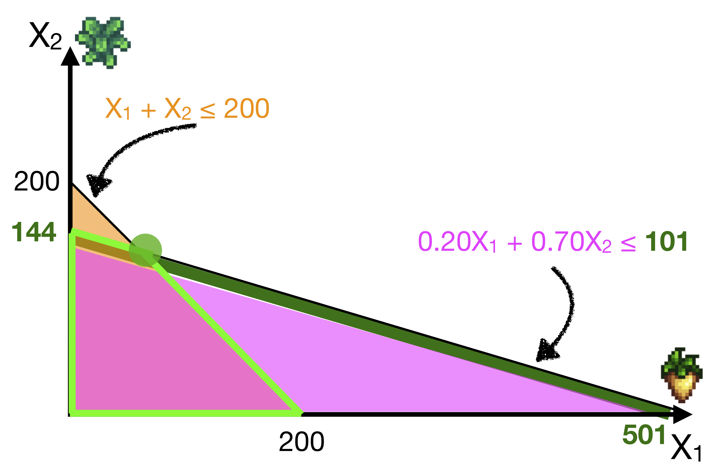

# Optimization I: Linear Optimization

<span class="badge badge-bt"> BT1101 </span>

In this chapter we will switch gears slightly to start talking about **Prescriptive Analytics**: that is, how to use analytics to make better decisions using data. 

We'll be discussing how to define certain problems as simple linear optimization problems: optimizing a given _objective function_, subject to certain linear _constraints_. We’ll cover how to use graphs to visualise and gain more intuition as to how to solve this problem. And finally, we will cover how to use R to solve the problem, as well as do additional _sensitivity analyses_.


The learning objectives for this chapter are:

- Given an optimisation problem statement, readers should be able to properly identify an objective function and relevant constraints.

- Readers should be familiar with linear optimisation concepts like the feasible region and finding optimal solutions as corner points of the feasible region.

- Readers should be able to solve simple linear optimisation problems. 

- Readers should be comfortable in interpreting the results of the optimisation and of sensitivity analyses, and preparing a recommendation memo with justifications.


- Readers should understand how and when integer constraints apply to optimisation problems.

- Readers should know how to use Linear-Program Relaxation (LP Relaxation) to gain insight into integer-constrained problems.

- Readers should understand how to solve integer-constrained optimisation problems.


```r
# Load the libraries we'll use in this chapter
library(ggplot2) # for plotting
library(lpSolve) # for solving linear optimization problems ('linear programming')
```


## What is Linear Optimization

<span class="badge badge-bt"> BT1101 </span>

Optimisation is used in every aspect of business: from operations, to finance, to HR, to marketing. Let's imagine that you run a little bakery, and you have to decide how many of each type of product to make. 
You can, of course, decide your product line by saying "I like making cupcakes", or "People really like my croissants". But if you really want to optimize your sales and scale up product, you would have to do your own research and consider a range of factors, such as: 

- what are the demand for each type of product, 
- what are the costs (in terms of time and materials) associated with each type of product

For example, from your "market research", you may discover that mille-crepes are the rage now (in 2019) but they're really effortful to make compared to normal cupcakes. So is it worth it to start branching out into this new product?


When companies have factories that make thousands (or more) of products a day, one really has to use _data_ to optimize the product mix. Note that this optimization isn't about making the manufacturing processes faster or cheaper (that's also a type of optimisation). Here we are interested in how _much_ we need to produce.


Some common use cases for linear optimization are:

- Product Mix: Deciding how much of each product to produce and sell.
- Product Line Planning: Deciding how much of each product to produce now vs later (e.g. targeting holiday sales season, using forecasts of supply/demand)
- Choosing an Investment Portfolio: we might be interested in choosing a mix of investment options that in this case might maximise our return, or perhaps minimise our risk exposure, subject to certain constraints.
- Optimising labor allocation: How best to schedule employees' work shifts?
- Optimising transportation and supply chain: How to route deliveries to minimize wait time? How to get materials from suppliers to warehouse to distributors---very important especially for perishable goods.
    - And many of us in today's world use on-demand gig apps for transportation, food delivery, and so forth. These apps require lots of optimisation, and employ very complicated techniques, so the linear optimization techniques in this chapter will provide but a glimpse of this.


Here are the basic steps in Linear Optimization, which we'll go over in the next few Sections.

1. Identify the Objective Function & Decision Variables
2. Identify the Constraints
3. Write down the Optimization model
4. Either:
    a. Solve graphically and/or manually
    b. Use R to solve
5. Conduct Sensitivity Analysis
6. Interpret results and make recommendations.


## Objective Functions & Decision Variables

<span class="badge badge-bt"> BT1101 </span>

Your goal (or objective) in linear optimisation is to optimise an objective function. This will be in the form of maximising or minimising some quantity of interest, by choosing the values of $X$, our Decision Variables.

Decision variables ($X$) are the variables that you get to pick. How many croissants to make? How many stocks of company A should I hold?

In the objective function, we choose $X$ to maximize or minimize some quantity of interest. Some common examples are to choose $X$ to:

- maximise profits.
- minimise costs / time spent
- minimise risk exposure

Where profits, costs, time spent, risk, etc, are given by some model of the world, that you as an analyst have come up with. 


I should note that we have already seen similar "optimization" in earlier chapters. For example, in Ordinary Least Squares Regression, we want to choose our regression coefficients ($b_0$, $b_1$, $b_2$...) to minimise the sum of squared errors. Or, we may want to choose model hyper parameters that maximises our model's accuracy (e.g., on the Validation Set)


Here, the difference is that we often formulate the objective function in terms of a real-world quantity (i.e., relevant to a business context) that we want to maximise or minimise, by choosing our X's.


### Jean the Farmer: Objective Function {-}

Let’s get introduced to Farmer Jean, who runs a small farm in a little [valley](https://www.stardewvalley.net/)^[Sprites and the costs/profits of Parsnips and Kale are borrowed from [Stardew Valley](https://www.stardewvalley.net/), and this example is an optimization problem that could actually arise in the game.], who will be with us throughout this chapter.

```
Farmer Jean has two types of crops, Parsnips and Kale. 
Parsnips cost $0.20 per plot to grow, and sell for $0.35 per plot.
Kale cost $0.70 per plot to grow, and sell for $1.10 per plot.

She has 200 plots of land, and a $100 budget. 
How many of each crop should she plant to maximise her profits?
```


Here, the decision variables are quite straightforward. We are just choosing how many plots of parsnips and plots of kale to grow. Let’s call them $X_1$ and $X_2$ respectively.

```
Define:
  X_1 = number of plots of parsnips grown
  X_2 = number of plots of kale grown
```

The objective function is just maximising profits, which is the selling price - cost price, multiplied by how many of each crop she grows. So Profits $= (0.35 - 0.20) X_1 + (1.10 - 0.70) X_2 = 0.15X_1 + 0.40X_2$

```
Objective function: Maximize Profits = 0.15 X_1 + 0.40 X_2
```


## Constraints

<span class="badge badge-bt"> BT1101 </span>

In Farmer Jean's case, obviously if we just wanted to maximise profits, we should just grow more and more of the profit maximising plant. But this is often not possible because of limited constraints. For example, you may not have unlimited budget, or unlimited time, or you may also need to fulfil certain criteria as part of your contract with your distributor. 

Formally, we represent these constraints as **mathematical inequalities** or equations. The inequalities can be *less than*, *greater than*, or *strictly equal*.
On the left hand side we put a function of our decision variables, and on the right hand side we put the value of the constraint.

So for example, if you have to "deliver within budget", this means that your total cost of your decisions must be less than/equal to your budget.
If you have to "deliver at least 50 units of product", this means that number of product produced must be greater than or equal to 50.
You may have to allocate working shifts to give exactly 40 hours of work per staff. So basically these constraints can be greater or less than or equal to some number.

Examples | Translates to:
--- | ---
Deliver within Budget | Total Cost $\leq$ Budget
Deliver at least 50 units of product | Product $\geq$ 50
Allocation must contain exactly 40 hours of work | Working Hours $=$ 40
Implicit: Products, hours of work must be non-negative | Product $\geq$ 0 <br> Hours $\geq$ 0


We also often have constraint called non-negativity constraints. For many of these decision variables that have real world meaning, they often cannot be negative. So we often specify that each of the decision variables must be greater than or equal to 0. These are *important* to specify explicitly, and in fact R assumes this.


### Jean the Farmer: Constraints {-}

Coming back to Farmer Jean, she has two types of constraints. First, she doesn’t have unlimited budget, with which she needs to pay the cost of growing each crop. So we can write this as the cost of producing parsnips times the amount of parsnips ($0.20X_1$), and the cost of producing kale times the amount of kale ($0.70X_2$), the sum of these two must be less than equal to 100.

The second constraint she has is that she only has 200 plots of land. So the total amount of crops she grows has to fit into these plots. So $X_1$ + $X_2$ must be less than or equal to 200. 

And finally we have the non-negativity constraints.

Name | Constraints
--- | ---
Budget Constraints | $0.20X_1 + 0.70 X_2 \leq 100$
Space Constraints | $X_1 + X_2 \leq 200$
Non-negativity | $X_1 \geq 0$ <br> $X_2 \geq 0$


## Solving the Optimization Model

<span class="badge badge-bt"> BT1101 </span>

Before we start, it is good practice to formally write down the optimisation model that you want to solve.

This summarises all the information in the problem into one system of equations to solve. So for the Farming Example, we have:


Decision Variables: <br> $X_1$ = number of plots of parsnips grown <br> $X_2$ = number of plots of kale grown | Maximize Profits = 0.15 $X_1$ + 0.40 $X_2$
--- | ---
_subject to_: | -
Budget Constraints | $0.20X_1 + 0.70 X_2 \leq 100$
Space Constraints | $X_1 + X_2 \leq 200$
Non-negativity | $X_1 \geq 0$ <br> $X_2 \geq 0$


Any solution that satisfies all the constraints is a _feasible_ solution. In optimization, we want to find the best / optimal feasible solution.


Let us understand this problem in more detail, by graphing our constraints as regions on an $X_1$-$X_2$ graph, with $X_1$ on the horizontal axis and $X_2$ on the vertical axis.

Below we've plotted the two constraints:


- $0.20X_1 + 0.70 X_2 \leq 100$, on the left, in magenta
- $X_1 + X_2 \leq 200$, on the right, in orange


Since these are linear constraints, we can easily plot them by defining two points for each line, and then connecting them. For example, in the left graph, we need to plot: $0.20X_1 + 0.70 X_2 \leq 100$. The first point that will be handy is where it crosses the vertical axis; in this case, $X_1 = 0$, and so we can solve $X_2 \leq (100/0.70)$, or $X_2 \leq 142$ (rounding down). The second point is where it crosses the horizontal axis. Now, $X_2 = 0$, and so $X_1 \leq (100/0.20)$ or $X_1 \leq 500$.

Thus, we can connect the point $X_1=0, X_2=142$ on the vertical axis, with $X_1=500, X_2=0$ on the horizontal axis with a straight line. Then we just read the constraint direction and reason that it should include the area down and to the left of this line!

Make sure you understand the right graph as well, and understand how to reproduce it!

```
Question: What do the non-negativity constraint regions look like?
```


#### Feasible Regions {-}

The **Feasible Region** is the intersection of all the constraint regions. So let's plot those two regions above on the same plot.


A **feasible solution** is an allocation of decision variables (like $X_1$ = 10, $X_2$ = 10), that satisfies all the constraints.

It also follows, that **every feasible solution will lie in the feasible region**. That means that every point within the feasible region (shaded in green above) could be a solution to this problem.


If there is no feasible region, then there is no feasible solution, and we say that the problem is *infeasible*. In other words, there is no way to solve this problem while satisfying all the constraints.


#### Corner Points {-}

While any point in the feasible region is a possible solution, it turns out that the optimal solution, if it exists, lies at a "corner" of the feasible region. Indeed, there are mathematical theorems proving this.

In the plot below we've indicated the four corner points for this problem:


Why must an optimal solution lie at a corner? Imagine that you have a solution in the center of the feasible region, not near a boundary. 
From here, you can still increase or decrease $X_1$; or you can increase or decrease $X_2$. These changes would either increase or decrease your profit ("better" or "worse"). 

So the best (and worst) solutions are when you cannot increase or decrease your decision variables any more!


Let's check our profits at each of the corner points. For three of them it's simple; we just set X1 and X2 to 0 (Bottom-Left), or we set X1 to 0 (Top-Left), or we set X2 to 0 (Bottom-Right).

\begin{align}
\text{Bottom-Left }:& \; X_1 = 0 ; \;\;\;\; X_2 = 0 ; \;\;\;\; \text{Profit} = 0 \quad [\textbf{Worst}] \\
\text{Top-Left }:& \; X_1 = 0 ; \;\;\;\; X_2 = 142 ; \; \text{Profit} = 56.8 \\
\text{Bottom-Right }:& \; X_1 = 200 ; \; X_2 = 0 ; \;\;\;\; \text{Profit} = 30 \\
\end{align}

```
Note, the WORST solution is also at a corner point. 
Can you reason out why?
In this case, the bottom-left point happens to be the worst!
```

At the fourth corner point (the top-right point), this point satisfies both the inequalities exactly. So they become equalities, which we can solve as a pair of simultaneous equations:

\begin{align}
X_1 + X_2 &= 200 \quad (1) \\
0.20X_1 + 0.70X_2 &= 100 \quad (2) \\
(1) \implies X_2 &= 200 - X_1 \\
\text{sub into } (2): 0.20X_1 + 0.70 (200 - X_1) &= 100 \\
(0.20 - 0.70) X_1 &= 100 - 140 \\
X_1 &= 80 \\
\implies X_2 &= 120
\end{align}

Hence, the solution is $X_1 = 80$, $X_2 = 120$, which gives us a profit of $0.15X_1 + 0.40X_2 = 60$.

This happens to be the maximum profit, so (80,120) gives us the optimal solution with a maximum profit of \$60.


#### Level Sets {-}


An alternative way to visualise this solution is to draw the level set of the objective function (i.e., profits).

The level set is the set of all the points that give the same profit. We indicate the direction in which we are optimising (i.e., direction of increasing profit), and we "shift" the level set as we increase profit.

The optimal solution is the last point before the level set leaves the feasible region as we optimise profits. 
(If the level set is parallel to a constraint line, we could also get a set of optimal solutions)


#### Solution Types {-}

There are 4 possible types of solutions:

1) There exists a unique optimal solution.

2) There exists multiple optimal solutions. <br>
Graphically, this occurs when the set of optimal solutions (i.e., the level set of the optimal solution) is parallel to / lies along a constraint. Thus, every point along that constraint will give an optimal solution.

3) The solution is unbounded <br> 

4) There exists no feasible solutions <br> 


#### Finding corner points in higher dimensions {-}

So we've seen that the optimal solution must lie on a corner point. This is true even if we have more than two variables and we cannot plot this on a 2D graph. A ten decision-variable problem will have a feasible region be a region in a ten dimensional space, also called a 10-dimensional polytope. The solution will lie on a corner, or vertex, of this polytope. 


<center>
 <br> <small>Image of a high-dimensional polytope and a path that Simplex Algorithm might take, from [Wikipedia](https://en.wikipedia.org/wiki/Simplex_algorithm)</small>
</center>


One algorithm to solve these optimization problems is called the Simplex Algorithm, which systematically checks through these corner vertices to find the optimal one. 

- The algorithm starts at a vertex (perhaps chosen randomly or through some initialization)
- It will then move along an edge ("side of polytope") to another vertex only if the objective function value along that edge is increasing. 
- It repeats this until it reaches a maximum, i.e., no such edges are found. 
- The algorithm terminates at the optimal solution, or reports that none are found (infeasible, or unbounded).

For this chapter, we do not cover *how* the Simplex algorithm works, but we just discuss the high-level intuition behind it. We will let *R* implement this algorithm and solve more difficult optimization problems for us.


## Using R to solve Linear Optimization

<span class="badge badge-bt"> BT1101 </span>

The most difficult part about using R to solve a linear optimization problem is to translate the optimization problem into code. Let's reproduce the table with all the necessary information for the example of Farmer Jean:

Decision Variables: <br> $X_1$ = number of plots of parsnips grown <br> $X_2$ = number of plots of kale grown | Maximize Profits = 0.15 $X_1$ + 0.40 $X_2$
--- | ---
_subject to_: | -
Budget Constraints | $0.20X_1 + 0.70 X_2 \leq 100$
Space Constraints | $X_1 + X_2 \leq 200$
Non-negativity | $X_1 \geq 0$ <br> $X_2 \geq 0$


Here's how you translate it into code. First, we define the objective function parameters, which are just the coefficients of $X_1$ and $X_2$ in the object function:  Profits = 0.15 $X_1$ + 0.40 $X_2$


```r
objective.fn <- c(0.15, 0.40)
```

Next, we define the constraints, which are broken up into 3 variables: the constraints matrix, the constraint directions, and the constraint values (or constraint RHS for right-hand-side).

$$0.20X_1 + 0.70 X_2 \leq 100$$
$$X_1 + X_2 \leq 200$$

The constraint matrix is simply concatenating all the coefficients here into a matrix. For simplicity, using the convention below, we just read off the matrix from top to bottom, then within each line, from left to right. So we have: (0.20, 0.70, 1, 1). When I construct the matrix, you have to specify the number of columns (`ncol`) which is simply the number of decision variables we have; in this case it's 2.

The constraint directions are just a vector that corresponds to each constraint ($\leq$, $\leq$), and the constraint right-hand-side values are just (100, 200)


```r
const.mat <- matrix(c(0.20, 0.70, 1, 1) , ncol=2 , byrow=TRUE) 
const.dir <- c("<=", "<=")
const.rhs <- c(100, 200)
```

The important thing to note is to get the order of all the constraints correct. In particular, if you have certain constraints that do not include ALL of the decision variables, to include `0`s whenever appropriate.

> <span style='color:blue; font-size:150%'>TIP!</span> 
> For example, if you have an additional constraint that you can only produce a maximum of 500 $X_1$, this constraint translates to: $X_1 \leq 500$ 
> <br><br> but to be even more helpful to yourself, write it out as:
> $$ 1 X_1 + 0 X_2 \leq 500 $$
> This will help you remember to put ... 1,0 ... into the relevant row of the constraints matrix when you are reading the matrix off from your table.


Finally, we put all of these into a call to the `lp` function within the `lpSolve` package. We specify `max` for maximizing the objective function, pass in the rest of the parameters we just defined, and finally we also ask it to `compute.sens=TRUE`: we need this for the sensitivity analysis in the next section.

```r
lp.solution <- lp("max", objective.fn, const.mat, 
                  const.dir, const.rhs, compute.sens=TRUE)
```

Putting it all together, and looking at the solution (`lp.solution$solution`) and objective function value (`lp.solution$objval`)

```r
# defining parameters
objective.fn <- c(0.15, 0.40)
const.mat <- matrix(c(0.20, 0.70, 1, 1) , ncol=2 , byrow=TRUE) 
const.dir <- c("<=", "<=")
const.rhs <- c(100, 200)
# solving model
lp.solution <- lp("max", objective.fn, const.mat, 
                  const.dir, const.rhs, compute.sens=TRUE)

# check if it was successful; it also prints out the objective fn value
lp.solution
```

```
## Success: the objective function is 60
```

```r
# optimal solution (decision variables values)
lp.solution$solution
```

```
## [1]  80 120
```

```r
# Printing it out:
cat("The optimal solution is:", lp.solution$solution, "\nAnd the optimal objective function value is:", lp.solution$objval)
```

```
## The optimal solution is: 80 120 
## And the optimal objective function value is: 60
```

Thus, the optimal solution is $X_1$ = 80, $X_2$ = 120, and the optimal profit is 60, which is what we found manually in the previous section.


## Sensitivity Analysis

<span class="badge badge-bt"> BT1101 </span>

When we get an optimal solution to a linear optimisation problem, oftentimes we may want to ask: what if we change the objective by a little, or what if we change the constraints by a little, what would happen? i.e., how sensitive is the solution to changes in the problem?

Sensitivity analysis allows us to ask this question systematically. Here we shall cover two types of sensitivity analyses -- varying objective function coefficients, and varying constraint values.

### Varying objective function coefficients {-}

Recall our farming example: our optimal solution is $X_1$ = 80, $X_2$ = 120, 
and our objective function is:
$$ \text{Profit} = 0.15 X_1 + 0.40 X_2 $$

What if Farmer Jean's customer decides to reduce the amount they are willing to pay for Kale ($X_2$) to $1.00 (reducing Jean’s profits from 0.40 to 0.30 per unit of $X_2$). 
$$ \text{Profit} = 0.15 X_1 + \color{red}{0.30} X_2 $$

Will that change our optimal solution?

Turns out, no, it doesn't. (Try running the code again to verify that the optimal solution is still (80,120)!)




But now if the price that Farmer Jean can sell Parsnips ($X_1$) drops from 0.35 to 0.30, i.e., reducing her profits per unit-parsnips from 0.15 to 0.10,

$$ \text{Profit} = \color{red}{0.10} X_1 + 0.40 X_2 $$
Then the optimal solution actually changes (to $X_1$ = 0, $X_2$ = 142)! Basically, Parsnips are now not profitable, and Jean should plant plant all Kale.



Graphically the optimal solution now moves from the blue vertex to the green vertex. The optimal solution is to produce as much Kale as she can afford.

Indeed in the first case, reducing the price of $X_2$ by 10 cents did not change the solution, but in the second case, reducing the price of $X_1$ by 5 cents did! So this solution is sensitive to some changes but not others.


#### Varying objective function coefficients in R {-}


R's `lpSolve::lp()` function helps you to calculate the *range* of coefficient values for which the given solution is still optimal. So again, recall that the original objective function is:
$$ \text{Profit} = 0.15 X_1 + 0.40 X_2 $$

We use `lp.solution$sens.coef.from` and `lp.solution$sens.coef.to` to get the range of coefficients.


```r
# sensitivity analysis on coefficients
lp.solution$sens.coef.from 
```

```
## [1] 0.1142857 0.1500000
```

```r
lp.solution$sens.coef.to
```

```
## [1] 0.400 0.525
```

The way you read this is that "from" is the lower bound of the coefficients ($X_1$ and $X_2$ respectively), while "to" gives the upper bound of the coefficients.

- This means that as long as the coefficient on $X_1$ lies between [0.1143, 0.400], 
this solution is still optimal.
- Or if the coefficient on $X_2$ lies between [0.150, 0.525], this solution is still optimal.

If the coefficients shift outside these ranges, then the solution will move to a different vertex. (How will they move?)


Note that all of these sensitivity calculations assume you only adjust one coefficient at a time. This means that if you decide to reduce $X_1$ to 0.12 and increase $X_2$ to 0.50, the optimal solution might change. These ranges assume that you only change that one coefficient while holding the rest constant. If you want to change two or more coefficients, you should re-run the model.


Now let's think through and try to predict what happens when these coefficients go out of these bounds. We just saw that if the coefficient on $X_1$ goes to 0.10, which is less than 0.1143, then the solution moves to: produce no $X_1$ and produce maximum $X_2$. 

What if the coefficient on $X_1$ goes above 0.400? What do you think will happen? Increasing the profit of $X_1$ beyond this range should mean that it has become more profitable to produce $X_1$, and we know that the solution must lie on a vertex, so we move down the edge of the feasible region to the solution on the horizontal axis, $X_1 = 200, X_2 = 0$.

Similarly, we can think about what will happen when the coefficient on $X_2$ drops below 0.15: it becomes not profitable to produce Kale, so we’ll also get the point $X_1 = 200, X_2 = 0$.
But when the coefficient on $X_2$ rises above 0.525, then it becomes much more profitable to produce Kale, so we’ll come to the solution $X_1 = 0, X_2 = 142$.


### Varying Constraint Values (Shadow Prices) {-}

The next type of sensitivity analysis we shall look at is what happens when we vary the constraint values.

We'll introduce a new term called _shadow prices_. 
The _Shadow Price_ of a constraint is the change in the objective function value per unit-increase in the right-hand-side value of that constraint (holding all else equal). Let's break this down.

In the Farming example, we have two constraints.


Let’s consider the first constraint. What if we increased the RHS of the first constraint from 100 to 101?

$$0.20X_1 + 0.70X_2 \leq 100 \quad \rightarrow \quad 0.20X_1 + 0.70X_2 \leq \color{green}{101}$$ 



The feasible region was pushed outwards a little, by adding this green segment. Doing this will move the optimal vertex up and to the left. 

The new solution is ($X_1$ = 78, $X_2$ = 122), which gives a profit of \$60.50 -- an increase of \$0.50

Thus, increasing the budgetary constraint by 1 unit (100 to 101) increases the profit by $0.50 (from \$60 to \$60.50). Hence, (by definition), **the Shadow Price of the first constraint is \$0.50**.

What this means is that if Farmer Jean increased her operating budget from \$100 to \$101, then she can increase her profits by \$0.50. That’s a pretty good return-on-investment! (Note that the optimal solution also changes, but here the shadow price indicates the effect of changing the constraint value on the **PROFIT**).


Next, let’s consider the second constraint. What if we increased the RHS of the second constraint from 200 to 201?

$$X_1 + X_2 \leq 200 \quad \rightarrow \quad X_1 + X_2 \leq \color{cyan}{201}$$ 


The feasible region was pushed out a little, by adding this cyan segment, which moved the optimal vertex down and to the right. 

The new solution is ($X_1$ = 81.4, $X_2$ = 119.6), which gives a profit of \$60.05 -- an increase by \$0.05

Thus, increasing the space constraint by 1 unit (200 to 201) increases the profit by \$0.05 (from \$60 to \$60.05).
The Shadow Price of the space constraint is \$0.05.


What this means is that if Farmer Jean increased her land plot size from 200 to 201, then she can increase her profits by \$0.05. That’s not as high as the budgetary constraints, so this translates to a good recommendation: if Jean wants to increase her profit, she gets more bang of the buck if she gets more operating budget than land space.


#### Varying Constraint Values in R {-}


Shadow prices are also known as `duals` in other fields (e.g. computer science), so we use `lp.solution$duals` to get them.


```r
# Shadow prices
lp.solution$duals
```

```
## [1] 0.50 0.05 0.00 0.00
```


Notice that there are four values here. The first two are the two constraints we put in, in the order they were specified in the constraints matrix (so $0.20X_1 + 0.70X_2 \leq 100$ then $X_1 + X_2 \leq 200$).
So we can see, as per our calculations above, that the shadow price of the first constraint is \$0.50, and that of the second constraint is \$0.05.

The last two are the shadow prices of the non-negativity constraints $X_1 \geq 0$, and $X_2 \geq 0$. This means that the change in the optimal profit, if we were to increase the right hand side values from 0 to 1, are both 0. Note that in some fields, the shadow prices of the non-negativity constraints have a special name, *reduced costs*. But the interpretation is the same.


Why would we have a shadow price of zero for these non-negativity constraints? In this particular case, in the optimal solution we are already producing non-zero quantities of $X_1$ and $X_2$. Thus, increasing the right-hand-side value (i.e., forcing us to produce at least 1 $X_1$ or at least 1 $X_2$) will not change our optimal solution. The shadow prices are zero.


### Binding vs non-binding constraints {-}

In general, constraints can either be *binding* or *non-binding* for the optimal solution. Constraints that are binding 'restrict' the optimal solution; so in the Parsnips/Kale example, both the Budget and Space constraints are binding; if we increase the right-hand-side of the constraints, we can do better and increase our profit. Hence, they have non-zero shadow prices.


Conversely, non-binding constraints do not restrict or bind the optimal solution. Thus, even if we change the right-hand-side value of the constraint by 1, we will not affect the optimal solution. Thus, **shadow prices are zero for non-binding constraints**.


In certain cases, we might even have *negative* shadow prices. Let's consider a modified objective function in the same Parsnip-Kale example, where the profit of Kale is increased to 0.53. 
$$ \text{Profit} = 0.15 X_1 + \color{red}{0.53} X_2 $$
We saw from our earlier sensitivity analysis that this will change the optimal solution to: $X_1 = 0, X_2 = 142$. Let's check this by re-running this modified linear optimization problem, saving it as `lp.solution2`:


```r
# defining parameters
objective.fn2 <- c(0.15, 0.53)
const.mat <- matrix(c(0.20, 0.70, 1, 1) , ncol=2 , byrow=TRUE) 
const.dir <- c("<=", "<=")
const.rhs <- c(100, 200)
# solving model
lp.solution2 <- lp("max", objective.fn2, const.mat, 
                   const.dir, const.rhs, compute.sens=TRUE)


# check if it was successful; it also prints out the objective fn value
lp.solution2
```

```
## Success: the objective function is 75.71429
```

```r
# Printing it out:
cat("The optimal solution is:", lp.solution2$solution, "\nThe optimal objective function value is:", lp.solution2$objval, "\nwith the following Shadow Prices", lp.solution2$duals)
```

```
## The optimal solution is: 0 142.8571 
## The optimal objective function value is: 75.71429 
## with the following Shadow Prices 0.7571429 0 -0.001428571 0
```

As we expected, the solution is $X_1 = 0, X_2 = 142$ (rounded down). Now, if we look at the shadow prices, we notice that the shadow price of the first constraint: $0.20X_1 + 0.70X_2 \leq 100$, is +0.75, so increasing the budget by \$1 will increase profits by \$0.75. The shadow price of the second constraint, $X_1 + X_2 \leq 200$, in this case, is 0. We can also see that because the total amount of land used $X_1 + X_2 = 0 + 142 = 142$ is much less than the available budget, this constraint now becomes non-binding at this solution, and hence the shadow price of this constraint is zero. Getting access to more land will not help improve profits.

But wait, the third shadow price returned by `lp.solution2$duals` is negative! What does that mean? This shadow price corresponds to the non-negativity constraint $X_1 \geq 0$. Going by the definition of the shadow price, this means that increasing the value of the right hand side of this constraint, to $X_1 \geq \color{red}{1}$ will reduce the optimum profit by -\$0.0014. This is because if this constraint were to be changed, then now we are forced to produce at least 1 unit of $X_1$, which is now less profitable, and hence total profit should go down.

Finally, note that this also implies that $X_1 \geq 0$ is a binding constraint, because changing the value of this constraint will affect the optimal solution. So binding constraints can have either positive, or negative, shadow prices.


### Summarizing sensitivity analyses {-}

Solving an optimization problem is straight-forward once you have the objective function and the constraints. Getting the optimal solution is not the end of it. As a top-notch business analyst, we can add more value to the business decision by doing and interpreting sensitivity analyses. 

i. We can examine the range of coefficients over which this solution is valid, and make recommendations. For example, we saw earlier than if the profit of Kale goes above 0.53 or profit per Parsnip goes below 0.11, then it makes more sense to switch to producing as much Kale as possible.
    - For example, you could provide the following recommendation to Farmer Jean: "If the profit per unit-Kale goes above \$0.53 or if the profit per unit-Parsnips goes below \$0.11, then please switch your whole production to Kale."

ii. Secondly, we can examine and interpret shadow prices:
    - For example, to Farmer Jean: "If you get one additional plot of land, you can make \$0.05 more profit. But if you get \$1 more of budget to buy crops, you can increase your profit by \$0.50 (by changing your planting allocation to ...)"


More broadly, as analysts we could run "what-if" analyses to study the impact of getting more resources, of changing our prices, and of many other possible business decisions. These type of analyses require much more experience, but are potentially much more valuable to making better business decisions.


## Linear Optimization Summary

<span class="badge badge-bt"> BT1101 </span>

In this chapter, we covered the basics of formulating and solving simple linear optimisation problems, which help us "prescribe" the best business choices to make. 

If you can formulate your real-world problem as a linear optimisation problem, then there are very efficient solvers and algorithms that can solve the problem, and to help you gain further insight into your problem (e.g., via sensitivity analyses).

In the models we've covered this chapter, we've assumed that all the decision variables are continuous, real-valued numbers.

In the next chapter, we will discuss linear optimisation problems where some of the decision variables have to be integers, as well as when some of the decision variables are binary yes/no decisions.


## [NOT DONE] Exercises

<span class="badge badge-bt"> BT1101 </span>

```
to be completed
```


